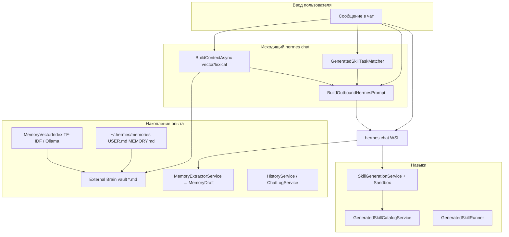

# Отчёт: накопление опыта и создание навыков (Hermes.Wpf)

**Дата:** 2026-05-18  
**Область:** Hermes.Wpf — External Brain, извлечение опыта из чата, WSL-память, vector memory, generated skills (кристаллизация, resolver, sandbox).  
**Связанные документы:** [External_Brain_Implementation_Report.md](External_Brain_Implementation_Report.md), [persistent_memory_skill_g.md](../Instructions/Gemini/persistent_memory_skill_g.md), [UI_Automation_and_Agent_Skills.md](../Plans/UI_Automation_and_Agent_Skills.md).

---

## 1. Обзор: две подсистемы

В текущем проекте **накопление опыта** и **навыки** связаны, но реализованы разными контурами.

| Подсистема | Цель | Где хранится | Автоматизм |
|------------|------|--------------|------------|
| **Опыт (memory)** | Долгосрочные факты, процедуры, эпизоды из чата и WSL | Markdown vault (Obsidian-стиль) | Частичный: черновик после каждого ответа; синхронизация WSL; ручное сохранение в vault |
| **Навыки (skills)** | Переиспользуемые инструменты/инструкции под задачи | `%AppData%\HermesWpf\skills\` + зеркало `~/.hermes/skills/` | Подбор под задачу — да; **создание нового** — только по `skill_save` / «сохрани как навык» |



---

## 2. Накопление опыта

### 2.1. Уровни памяти (как в концепции Gemini, фактически в WPF)

| Уровень | Реализация в Hermes.Wpf |
|---------|-------------------------|
| **Краткосрочная (сессия)** | `ChatViewModel.Messages`, `ChatLogService` (лог по проекту), `HistoryService` (восстановление при смене проекта) |
| **Долгосрочная семантическая** | `ExternalBrainService` + опционально `MemoryVectorIndex` (TF-IDF, при доступности Ollama — dense embeddings) |
| **Логическая / профиль** | WSL `USER.md`, `MEMORY.md` → экспорт в vault; отдельного `SOUL.md` и self-edit в WPF **нет** |

### 2.2. External Brain (основной vault)

**Сервис:** `Hermes.Wpf/Services/ExternalBrainService.cs`  
**Модель:** `Hermes.Wpf/Models/MemoryItem.cs`  
**Парсинг:** `ExternalBrainMarkdown.cs`

**Путь к vault** (`ResolveEffectiveMemoryPath`, по приоритету):

1. `HERMES_EXTERNAL_BRAIN_PATH`
2. `%AppData%\HermesWpf\externalBrain.json` → `{ "MemoryPath": "..." }`
3. `HermesSettings.ExternalBrainMemoryPath` (`settings.json`)

**Жизненный цикл:**

- При старте и при изменении `*.md` — `ReloadFromDiskAsync` → кэш `ImmutableList<MemoryItem>`
- `FileSystemWatcher` с debounce ~450 ms
- После перезагрузки — `MemoryVectorIndex.RebuildAsync` (если включён vector retrieval)

**Подмешивание в промпт Hermes:**

- Условие: `ExternalBrainInjectIntoPrompt == true`
- Вызов: `BuildContextAsync(userQuery, ExternalBrainMaxContextItems)` в `MainViewModel.ExecuteHermesUserTurnAsync`
- Блок не показывается в пузыре чата; добавляется в `BuildOutboundHermesPrompt` как `--- EXTERNAL BRAIN ... ---`

**Поиск релевантных записей:**

| Режим | Условие | Механизм |
|-------|---------|----------|
| Vector | `ExternalBrainVectorRetrievalEnabled` | `MemoryVectorIndex.SelectTopAsync` — cosine similarity + importance/recency |
| Lexical (fallback / если vector off) | иначе | `ScoreMemories` — токены в content/tags/filename |

Лог vector: `[vector-memory] Querying vector memory…`, `[vector-memory] TF-IDF index ready` / `Ollama index ready`.

**UI:** `ExternalBrainWindow` — поиск, теги, превью (`ExternalBrainViewModel`).

### 2.3. Синхронизация памяти из WSL Hermes CLI

**Сервис:** `WslAgentMemorySyncService.cs`  
**Пути:** `WslAgentMemoryPaths.cs` → `\\wsl$\<distro>\home\<user>\.hermes\memories\`

| Файл WSL | Папка в vault | Тип в YAML |
|----------|---------------|------------|
| `USER.md` | `Identity/` | identity |
| `MEMORY.md` | `Knowledge/` | semantic |

**Когда синхронизируется** (`MainViewModel.SyncWslAgentMemoryToVault`):

- Старт приложения (`startup`)
- После успешного ответа Hermes (`after-chat`)
- После закрытия Settings (`settings`)

Условие: `SyncWslAgentMemoryToExternalBrain == true` и задан vault.

После записи: `ExternalBrainService.RestartWatcherAndReload("wsl-memory-sync")`.

**UI:** вкладка WSL Memory (`WslMemoryViewModel`).

### 2.4. Извлечение «опыта» из пары вопрос–ответ (черновик)

**Сервис:** `MemoryExtractorService.cs`  
**Модель:** `MemoryDraft.cs`

**Когда вызывается:** после каждого **успешного** хода Hermes в чате:

```csharp
_lastExperienceDraft = _memoryExtractor.ExtractExperience(payload, displayResponse);
```

**Логика классификации** (`ExtractExperience`):

- Тип: `semantic` | `episodic` | `procedural` — по эвристикам в тексте задачи и ответа
- `Importance` 1–5
- `Tags`, `Reusable` (краткое резюме), YAML frontmatter в `GenerateMarkdown`

**Сохранение на диск — не автоматическое:**

- `ShouldSave(draft)` отсекает слишком короткие черновики
- Пользователь сохраняет через UI: `MemoryEditorWindow`, команда «Save experience» (`GetLastExperienceDraft()`)
- Путь в vault: подпапки `Knowledge/`, `Procedures/`, `Projects/`, `Identity/` по типу

**Связь с навыками:** после сохранения навыка `GeneratedSkillVaultSyncService` пишет отдельную заметку в `Procedures/GeneratedSkills/` — это **не** тот же pipeline, что `MemoryExtractorService`.

### 2.5. Прочие каналы опыта

| Канал | Компонент | Примечание |
|-------|-----------|------------|
| English Tutor | `EnglishTutorVocabularyStore`, экспорт в Obsidian | Лексика репетитора, не общий vault |
| Supabase relay | `SupabaseHermesRelay` | Синхронизация **сообщений** чата, не структурированной памяти |
| Flashcards | `FlashcardSkill` | JSON в Supabase для WordPress, не vault |

---

## 3. Навыки (generated skills)

### 3.1. Что такое «навык» в проекте

Навык — каталог с манифестом и опциональным скриптом, **не** плагин с единым интерфейсом `ISkill`.

```
%AppData%\HermesWpf\skills\<id>\
  manifest.json    # метаданные, triggers, kind, testCommand
  SKILL.md         # описание (agentskills.io-стиль)
  run.ps1 | run.py # если kind=script
```

Зеркало (опционально): `~/.hermes/skills/<id>/`  
Индекс: `skills/index.json` (Windows + WSL).

### 3.2. Типы навыков (`kind`)

| kind | Поведение |
|------|-----------|
| `script` | `GeneratedSkillRunner` — PowerShell/Python из папки навыка |
| `prompt` | `outbound_prompt_block` подмешивается в каждый `hermes chat` |
| `intent` | Запуск через JSON `{"skill":"run_generated","id":"…"}` в ответе Hermes |

### 3.3. Автовыбор навыка под задачу (Skill resolver) — **не генерация**

**Назначение:** для задачи «Запакуй folder в zip» подсказать Hermes уже **существующий** навык `manage_zip`, если он есть в каталоге.

| Компонент | Файл |
|-----------|------|
| Ранжирование | `GeneratedSkillTaskMatcher.cs` |
| Блок промпта | `SkillResolverInstructions.cs` |
| Интеграция | `MainViewModel` → `SkillTurnHints.TaskMatches` |

**Алгоритм `Rank(userTask, maxItems, minScore)`:**

- TF-IDF по корпусу: id, title, summary, triggers, outbound block
- Лексические бонусы: совпадение триггеров, токенов id (`manage` + `zip`), concept affinity (zip/архив/запак ↔ zip в haystack)
- Итоговый score = 0.55×TF-IDF + 0.45×lexical; порог `SkillResolveMinScore` (по умолчанию 0.28)

**В промпт** (если `SkillAutoResolveForTasks`):

- Секция «Skill resolver — matched saved skills for THIS user task»
- Инструкция: при score ≥ 0.5 вывести `{"skill":"run_generated","id":"…"}` вместо переписывания с нуля

**Лог:** `[skill-resolver] task → <id> (score=…, …)`

**Локальный запуск без Hermes:**

- Триггер в тексте → `GeneratedSkillCatalogService.MatchTrigger` → `TryHandleGeneratedSkillLocalAsync`
- Явная фраза «запусти навык manage_zip» → `SkillRunTriggers`

### 3.4. Создание **нового** навыка (кристаллизация)

**Автоматического создания навыка после каждой задачи нет.** Новый навык появляется только по цепочке ниже.

#### Триггеры начала кристаллизации

1. **Фраза пользователя** — `SkillCrystallizeTriggers` («сохрани как навык», «кристаллизуй», `save as skill`, …)
2. **Промпт** — `SkillReflectionService.CrystallizeNowBlockRu` + excerpt последних ~12 сообщений чата
3. **Ответ Hermes** — компактный JSON `{"skill":"skill_save",…}` (правила в `SkillGenerationInstructions`)

#### Обработка ответа

`SkillCrystallizeIntentParser.TryConsumeSaveIntent` → `SkillSavePayload`  
`SkillGenerationService.TrySaveAsync`:

| Шаг | Сервис | Лог |
|-----|--------|-----|
| 1. Sandbox (для script) | `SkillSandboxService` | `[skill-sandbox] Executing task in sandbox…` |
| 2. Отклонение опасных команд | regex в sandbox | сохранение не выполняется |
| 3. Запись файлов | `SkillGenerationService` | `[skill-gen] Skill '…' successfully generated and saved` |
| 4. Зеркало WSL | copy в `~/.hermes/skills/` | `[skill-gen] mirrored …` |
| 5. Индекс | `GeneratedSkillIndexService` | `[skill-index] wrote …` |
| 6. Vault | `GeneratedSkillVaultSyncService` | `[skill-vault] exported …` |
| 7. UI-каталог | `GeneratedSkillCatalogService.Reload` | вкладка «Сгенерированные навыки» |

**Повтор id:** при существующей папке — суффикс `_2`, `_3`, … до `SkillMaxGenerationAttempts`.

#### Пример `skill_save` JSON

```json
{
  "skill": "skill_save",
  "id": "manage_zip",
  "title": "Упаковка папки в ZIP",
  "summary": "Создаёт zip-архив из указанной папки.",
  "triggers": ["zip", "архив", "запакуй"],
  "kind": "script",
  "script_extension": "ps1",
  "script_body": "# PowerShell…",
  "test_command": "powershell -NoProfile -ExecutionPolicy Bypass -File run.ps1"
}
```

Альтернативный формат: блок `HERMES_SKILL_CRYSTALLIZE_BEGIN` … `END` с JSON внутри.

#### Запуск сохранённого навыка из ответа Hermes

`SkillCrystallizeIntentParser.TryConsumeRunIntent` → `{"skill":"run_generated","id":"…"}` → `GeneratedSkillRunner.RunAsync`.

---

## 4. Доставка знаний Hermes (Q&A по памяти и навыкам)

| Канал | Компонент | Когда |
|-------|-----------|--------|
| **Всегда в промпт** | `HermesPlatformKnowledgeInstructions.OutboundBlockRu` | Каждый `hermes chat` через `BuildOutboundHermesPrompt` |
| **Vault для retrieval** | `HermesPlatformKnowledgeSyncService` → `Knowledge/Hermes/Experience_and_Skills_Logic.md` | Старт, после чата, закрытие Settings; источник — `Docs/Report/Experience_And_Skills_Logic_Report.md` или fallback-тело |

Лог синхронизации: `[platform-knowledge] exported …`

---

## 5. Сквозной сценарий: один ход чата

Порядок в `MainViewModel.ExecuteHermesUserTurnAsync` (упрощённо):

1. Локальные обработчики (flashcards, Reni water, screenshot, **generated skill trigger/run**) — могут завершить ход без CLI.
2. `ExternalBrainService.BuildContextAsync` — опыт в промпт.
3. Формирование `EnglishTutorTurnHints`, `SkillTurnHints` (crystallize + **taskMatches**).
4. `BuildOutboundHermesPrompt` — External Brain + Skill resolver + skill instructions + generated outbound blocks.
5. `HermesService.SendMessageAsync` → WSL `hermes chat`.
6. Разбор ответа: `skill_save` / `run_generated` / flashcards / обычный текст.
7. `_lastExperienceDraft = ExtractExperience(...)`; `SyncWslAgentMemoryToVault("after-chat")`; история; Supabase.

---

## 6. Настройки (`HermesSettings` / Settings UI)

### External Brain / память

| Параметр | По умолчанию |
|----------|--------------|
| `ExternalBrainMemoryPath` | пусто (через env/json) |
| `ExternalBrainInjectIntoPrompt` | true |
| `ExternalBrainMaxContextItems` | 12 |
| `ExternalBrainVectorRetrievalEnabled` | true |
| `ExternalBrainUseOllamaEmbeddings` | true |
| `ExternalBrainOllamaBaseUrl` | http://127.0.0.1:11434 |
| `ExternalBrainEmbeddingModel` | nomic-embed-text |
| `SyncWslAgentMemoryToExternalBrain` | true |

### Skill generation

| Параметр | По умолчанию |
|----------|--------------|
| `SkillGenerationEnabled` | true |
| `SkillMirrorToWslHermes` | true |
| `GeneratedSkillsDirectory` | пусто → `%AppData%\HermesWpf\skills` |
| `SkillMaxGenerationAttempts` | 3 |
| `SkillRunTestsBeforeSave` | true |
| `SkillSandboxBeforeSave` | true |
| `SkillSandboxTimeoutSeconds` | 60 |
| `SkillAutoResolveForTasks` | true |
| `SkillResolveMaxSuggestions` | 3 |
| `SkillResolveMinScore` | 0.28 |

Файл настроек: `%AppData%\HermesWpf\settings.json`.

---

## 7. Ключевые файлы (справочник)

### Опыт

| Файл | Назначение |
|------|------------|
| `Services/ExternalBrainService.cs` | Vault, контекст, watcher |
| `Services/MemoryVectorIndex.cs` | Vector retrieval |
| `Services/OllamaEmbeddingClient.cs` | Embeddings API |
| `Services/MemoryExtractorService.cs` | Черновик опыта из чата |
| `Services/WslAgentMemorySyncService.cs` | WSL → vault |
| `Services/WslAgentMemoryPaths.cs` | Пути WSL memories |
| `Views/MemoryEditorWindow.xaml.cs` | Ручное сохранение черновика |
| `ViewModels/ExternalBrainViewModel.cs` | UI vault |

### Навыки

| Файл | Назначение |
|------|------------|
| `Services/GeneratedSkillCatalogService.cs` | Загрузка каталога, triggers, enable/disable |
| `Services/GeneratedSkillTaskMatcher.cs` | Skill resolver |
| `Services/SkillResolverInstructions.cs` | Текст блока resolver |
| `Services/SkillGenerationService.cs` | Сохранение skill_save |
| `Services/SkillSandboxService.cs` | Pre-save sandbox |
| `Services/SkillCrystallizeIntentParser.cs` | Парсинг JSON |
| `Services/SkillCrystallizeTriggers.cs` | Фразы «сохрани как навык» |
| `Services/SkillRunTriggers.cs` | «запусти навык id» |
| `Services/SkillReflectionService.cs` | Reflective phase |
| `Services/SkillGenerationInstructions.cs` | Правила skill_save в промпт |
| `Services/GeneratedSkillRunner.cs` | Запуск run.ps1/py |
| `Services/GeneratedSkillIndexService.cs` | index.json |
| `Services/GeneratedSkillVaultSyncService.cs` | Vault Procedures/GeneratedSkills |
| `Services/GeneratedSkillPaths.cs` | Пути Windows/WSL |
| `ViewModels/GeneratedSkillsViewModel.cs` | UI списка навыков |
| `ViewModels/MainViewModel.cs` | Оркестрация |

### Оркестрация

| Файл | Назначение |
|------|------------|
| `ViewModels/MainViewModel.cs` | Чат, промпт, post-process |
| `Views/MainWindow.xaml.cs` | Создание сервисов, startup sync |

---

### Платформа (знание для Hermes)

| Файл | Назначение |
|------|------------|
| `Services/HermesPlatformKnowledgeInstructions.cs` | Блок в каждый outbound промпт |
| `Services/HermesPlatformKnowledgeSyncService.cs` | Экспорт отчёта в vault |

## 8. Жёстко зашитые навыки (не generated skills)

Отдельно от каталога `skills/` в WPF реализованы **встроенные** возможности (без `manifest.json`):

| Навык | Класс / сервис | Триггер |
|-------|----------------|---------|
| Flashcards | `FlashcardSkill`, `FlashcardRelayIntentParser` | JSON / Supabase |
| Reni water | `ReniWaterScheduleSkill`, `ReniWaterScriptService` | фразы + UI |
| Desktop screenshot | `DesktopScreenCaptureService` | «скриншот» |
| Mouse | `MouseSkillService` | Settings + UI |
| English tutor | промпт-блоки | фразы включения |

Каталог статических карточек: `Services/AgentSkillsCatalog.cs` (вкладка «Навыки»).

---

## 9. Что не реализовано (gap vs концепция Voyager / Gemini doc)

| Возможность | Статус |
|-------------|--------|
| Автосоздание навыка после **любой** успешной задачи без `skill_save` | Нет |
| Docker sandbox | Нет (temp + timeout) |
| Chroma/Qdrant как отдельная БД в WPF | Нет (vault + TF-IDF/Ollama) |
| `SOUL.md` self-edit | Нет |
| Единый plugin host `ISkill` | Нет |
| Регистрация навыков как native tools Hermes CLI | Нет (только index.json + файлы) |
| Redis / отдельный episodic store | Нет (чат + файлы) |
| Автосохранение `MemoryDraft` в vault без пользователя | Нет |

---

## 10. Рекомендуемые логи для отладки

| Префикс | Смысл |
|---------|--------|
| `[external-brain]` | Загрузка vault, watcher |
| `[vector-memory]` | Индекс и запрос vector memory |
| `[wsl-memory-sync]` | Экспорт USER/MEMORY из WSL |
| `[skill-resolver]` | Подбор навыка под задачу |
| `[skill-gen]` | Кристаллизация / сохранение |
| `[skill-sandbox]` | Прогон script перед save |
| `[skill-index]` | index.json |
| `[skill-vault]` | Экспорт в Procedures/GeneratedSkills |
| `[skill]` / `[skill-ui]` | Локальный run |
| `[skill-run]` | Вывод script |

---

| `[platform-knowledge]` | Синхронизация справки в vault |

## 11. Краткие ответы на типовые вопросы

**Как накапливается опыт?**  
Через Markdown vault (ручные заметки, экспорт WSL, ручное сохранение черновика из чата), подмешивание релевантных фрагментов в каждый запрос к Hermes (vector/lexical), плюс логи чата на диске.

**Как создаётся новый навык?**  
Только когда Hermes (по запросу «сохрани как навык» или по инструкции) возвращает `skill_save`, WPF валидирует в sandbox и пишет файлы в `skills/`.

**Почему «Запакуй в zip» не создаёт навык сам?**  
Resolver только **находит** `manage_zip`, если он уже сохранён; создание — отдельный явный шаг кристаллизации.

**Где читать пользовательскую инструкцию?**  
`Docs/Instructions/Gemini/persistent_memory_skill_g.md` (обновлена под текущую сборку WPF). Сводный отчёт: [Hermes_Current_Implementation_Report.md](Hermes_Current_Implementation_Report.md).

---

*Конец отчёта.*
