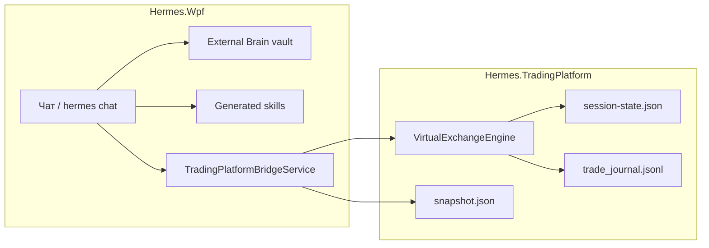

# Отчёт о текущей реализации проекта Hermes

**Дата:** 2026-05-18  
**Репозиторий:** `D:\Programming\AI_Agents\Hermes`  
**Фокус запроса:** опыт и самообучение при решении задач; опыт и самообучение в контексте трейдинга.

Связанные документы (детализация по подсистемам):

- [Experience_And_Skills_Logic_Report.md](Experience_And_Skills_Logic_Report.md) — память, навыки, resolver, кристаллизация
- [External_Brain_Implementation_Report.md](External_Brain_Implementation_Report.md) — vault, vector retrieval
- [Hermes_Trading_Platform_Integration.md](Hermes_Trading_Platform_Integration.md) — bridge, режим трейдинга, JSON `skill:trading`
- [Instructions/Gemini/persistent_memory_skill_g.md](../Instructions/Gemini/persistent_memory_skill_g.md) — пользовательская модель памяти

---

## 1. Обзор экосистемы

Hermes — набор Windows/WPF-приложений и библиотек вокруг агента **Hermes** (WSL `hermes chat`). Центральный клиент — **Hermes.Wpf** (Command Center, чат, память, навыки). Отдельно развёрнуты:

| Компонент | Назначение |
|-----------|------------|
| **Hermes.Wpf** | Чат, проекты, External Brain, generated skills, интеграция с Trading Platform |
| **Hermes.TradingPlatform** | Paper-terminal: virtual exchange, риск, стратегии, orchestration, журнал сделок |
| **Hermes.DesktopCapture / DesktopInteraction / MouseBridge** | Скриншоты, UI-автоматизация, мышь |
| **Hermes.WpGallery / WpGallery.Tool** | WordPress-галерея и загрузка медиа |
| **Source/** | Прототипы (DesktopVoiceChat и др.) |

Логи: `Logs\{AppName}\` (или `HERMES_LOGS_ROOT`). Торговая сессия и bridge: `%LocalAppData%\HermesTrading\`.



---

## 2. Опыт и самообучение (общие задачи)

В проекте **«опыт»** и **«самообучение»** — не один механизм, а связка из четырёх контуров с разным уровнем автоматизации.

### 2.1. Что считается «опытом»

| Уровень | Где хранится | Как попадает в следующий диалог |
|---------|--------------|----------------------------------|
| **Сессия чата** | RAM + `HistoryService` (`%LocalAppData%\HermesWpf\history\{project}.json`) + `ChatLogService` (`Logs/Hermes.Wpf/{project}/chat_*.log`) | История сообщений в UI; логи для человека |
| **Долгосрочная память (vault)** | Markdown `*.md` в External Brain (Obsidian-стиль: `Knowledge/`, `Procedures/`, `Projects/`, `Identity/`) | `ExternalBrainService.BuildContextAsync` → блок `--- EXTERNAL BRAIN ---` в промпт |
| **Профиль WSL-агента** | `~/.hermes/memories/USER.md`, `MEMORY.md` | Односторонний экспорт в vault (`WslAgentMemorySyncService`) |
| **Черновик из чата** | `MemoryDraft` в RAM (`_lastExperienceDraft`) | Только после **ручного** сохранения через Memory Editor |

Ключевой принцип (зашит в `HermesPlatformKnowledgeInstructions` и в промпт каждого `hermes chat`): **после каждого успешного ответа клиент строит черновик опыта, но в vault автоматически не пишет**.

### 2.2. External Brain — ядро долгосрочного опыта

**Сервис:** `Hermes.Wpf/Services/ExternalBrainService.cs`  
**Модель записи:** `MemoryItem` (YAML frontmatter + тело Markdown)  
**Путь vault:** `HERMES_EXTERNAL_BRAIN_PATH` → `%AppData%\HermesWpf\externalBrain.json` → `settings.json`

**Извлечение релевантного контекста:**

1. При `ExternalBrainInjectIntoPrompt == true` перед каждым `hermes chat` вызывается `BuildContextAsync(userQuery, maxItems)` (по умолчанию 12, макс. 20).
2. Если включён vector retrieval (`ExternalBrainVectorRetrievalEnabled`):
   - `MemoryVectorIndex` — TF-IDF baseline; при доступном Ollama — dense embeddings (`nomic-embed-text`, кэш в `%AppData%\HermesWpf\vector-cache\`).
3. Иначе — лексический скоринг по content/tags/имени файла + вес importance/recency.
4. Fallback — последние записи, если совпадений нет.

**Обновление индекса:** `FileSystemWatcher` на `*.md` (debounce ~450 ms) → `ReloadFromDiskAsync` → пересборка vector index.

**UI:** `ExternalBrainWindow` — поиск, теги, превью, открытие папки vault.

### 2.3. Автоматическое извлечение черновика (без автосохранения)

**Сервис:** `MemoryExtractorService.cs`  
**Вызов:** после успешного хода в `MainViewModel.ExecuteHermesUserTurnAsync`:

```csharp
_lastExperienceDraft = _memoryExtractor.ExtractExperience(payload, displayResponse);
```

**Эвристики классификации:**

| Тип | Когда |
|-----|--------|
| `semantic` | Объясняющие вопросы («что такое», `how does`, …) |
| `episodic` | Ошибки/сбои в ответе |
| `procedural` | Длинный ответ, нумерованные шаги |

Дополнительно: `Importance` 1–5, теги (`hermes`, `chat`, kind, опционально `dotnet` / `supabase`), поле `Reusable`.

**Сохранение:** кнопка / команда «Save experience» → `MemoryEditorWindow` → файл `{vault}/{Knowledge|Procedures|Projects|Identity}/{yyyy-MM-dd_HH-mm}_{type}.md`.  
`ShouldSave(draft)` отсекает слишком короткие черновики (< 24 символов суммарно).

### 2.4. Что подразумевается под «самообучением» в текущей сборке

Полностью автономного цикла («каждый успешный ответ → новая запись в vault / новый навык») **нет**. Реализовано **полуавтоматическое обогащение**:

| Механизм | Автоматизация | Файлы / триггеры |
|----------|---------------|------------------|
| **Skill resolver** | Да — подбор *существующих* навыков под задачу (TF-IDF + лексика) | `GeneratedSkillTaskMatcher`, `SkillResolverInstructions`; лог `[skill-resolver]` |
| **Кристаллизация навыка** | По запросу пользователя или JSON `skill_save` от модели | `SkillGenerationService`, `SkillSandboxService`, `SkillCrystallizeIntentParser` |
| **Синх WSL-памяти** | Да — при startup, after-chat, settings | `WslAgentMemorySyncService` |
| **Синх справки о платформе** | Да — копия отчёта в vault | `HermesPlatformKnowledgeSyncService` → `Knowledge/Hermes/Experience_and_Skills_Logic.md` |
| **Блок самоописания Hermes** | Да — в *каждый* outbound промпт | `HermesPlatformKnowledgeInstructions.OutboundBlockRu` |
| **English tutor / flashcards** | Отдельные режимы (лексика, Supabase) | Не общий pipeline опыта |

**Создание нового навыка** — только цепочка: фраза «сохрани как навык» / `skill_save` → sandbox → `%AppData%\HermesWpf\skills\<id>\` (+ зеркало `~/.hermes/skills/`, `index.json`, заметка в `Procedures/GeneratedSkills/`).

**Запуск сохранённого навыка:** JSON `{"skill":"run_generated","id":"…"}` или локальные триггеры / «запусти навык &lt;id&gt;».

### 2.5. Встроенные навыки (не generated skills)

Отдельно от каталога `skills/`:

| Навык | Реализация |
|-------|------------|
| Flashcards | `FlashcardSkill` → Supabase / WordPress |
| English tutor | `EnglishTutorVocabularyStore`, экспорт в vault English paths |
| Desktop screenshot | `DesktopScreenCaptureService` |
| Mouse | `MouseSkillService` |
| Reni water | `ReniWaterScheduleSkill` |
| Trading (из чата) | `TradingPlatformBridgeService` + `TradingPlatformIntentParser` |

Статический каталог UI: `AgentSkillsCatalog.cs`.

### 2.6. Сквозной сценарий одного хода чата (упрощённо)

1. Локальные обработчики (flashcards, screenshot, skill trigger/run, …) — могут завершить ход без CLI.
2. `BuildContextAsync` — релевантный vault в промпт.
3. `SkillTurnHints` — resolver + инструкции кристаллизации.
4. `BuildOutboundHermesPrompt` — External Brain + resolver + platform knowledge + trading snapshot (если режим).
5. `hermes chat` (WSL).
6. Разбор ответа: `skill_save`, `run_generated`, `skill:trading`, flashcards, текст.
7. `ExtractExperience` → черновик; `SyncWslAgentMemoryToVault("after-chat")`; история; Supabase relay (сообщения, не структурированная память).

### 2.7. Явные ограничения (gap vs «полное» самообучение)

| Возможность | Статус |
|-------------|--------|
| Автосохранение каждого `MemoryDraft` в vault | **Не реализовано** |
| Новый навык после любой успешной задачи без `skill_save` | **Не реализовано** |
| `SOUL.md` self-edit | **Не реализовано** |
| Chroma/Qdrant как отдельная БД | **Не в WPF** (vault + TF-IDF/Ollama) |
| Docker sandbox для навыков | **Нет** (temp dir + timeout) |
| Единый plugin host `ISkill` | **Не реализовано** |
| Native registration навыков в Hermes CLI | **Нет** (файлы + index.json) |

---

## 3. Опыт и самообучение в контексте трейдинга

Торговый контур **отделён** от External Brain: операционные данные живут в терминале и bridge; **семантическое «обучение на сделках» в vault не реализовано**.

### 3.1. Архитектура интеграции

| Роль | Компонент |
|------|-----------|
| UI + чат | `Hermes.Wpf` |
| Paper-terminal | `Hermes.TradingPlatform.Wpf` |
| Обмен состоянием | File-bridge `%LocalAppData%\HermesTrading\bridge\` |
| CLI для команд | `Hermes.TradingPlatform.Cli` (`enqueue`, `wait-result`, `status`) |

**Файлы bridge:**

| Файл | Назначение |
|------|------------|
| `snapshot.json` | Live-состояние (баланс, equity, позиции, ордера, риск, стратегии) |
| `commands.json` | Очередь команд от Wpf |
| `result-{guid}.json` | Результат команды |
| `heartbeat.txt` | Свежесть &lt; 12 с (терминал жив) |

**Wpf:** `TradingPlatformBridgeService` — публикует snapshot в промпт (`BuildSnapshotContextBlockRu`), парсит `{"skill":"trading",...}` (`TradingPlatformIntentParser`), выполняет через CLI. Ордера проходят **VirtualExchangeEngine** и **RiskValidator**; Wpf не обходит риск.

### 3.2. Режимы persona (не память, а поведение модели)

| Режим | Включение | Поведение |
|-------|-----------|-----------|
| **Трейдинг** | `трейдинг` / `trading` (persist в settings) | `TradingModePromptDefaults.ActivePersonaRu` — трейдер-исполнитель, snapshot, JSON для действий |
| **Агент** | `режим агента` | `NormalModeGuardRu` — не торговать без переключения |

При торговом запросе в общем режиме клиент может спросить о переключении (`SwitchPromptUserBubble`).

Узкие ответы (только баланс / полная сводка): `TradingQueryIntent` + `ScopeInstructionForTurn`.

### 3.3. Что сохраняется по торговле (операционный «опыт»)

| Артефакт | Путь / механизм | Назначение |
|----------|-----------------|------------|
| **session-state.json** | `%LocalAppData%\HermesTrading\` | Атомарное сохранение сессии: account, PnL, позиции, ордера, journal (до 1000 записей), тикеры, стратегии, `NextOrderSequence` |
| **TradingStatePersistence** | Debounce 400 ms + save on fill | Автосохранение при изменении state / исполнении |
| **trade_journal.jsonl** | Рядом с session + `Logs/Hermes.TradingPlatform/trade_journal_*.jsonl` | Append-only журнал исполнений |
| **TradeJournalProjection** | На `OrderFilledEvent` | Запись в in-memory journal + файл |
| **UI Journal** | `JournalViewModel`, также на вкладке Positions | Просмотр человеком |
| **Логи сессии** | `trading_session_*.log` | Bridge, exchange, диагностика |

**Восстановление после перезапуска:** загрузка `session-state.json` при старте host; баланс, позиции, журнал сохраняются.

**Звуковая обратная связь:** `TradingSoundService` (toggle в Settings терминала).

### 3.4. Как торговый «опыт» попадает в Hermes-чат сегодня

| Канал | Есть в промпт? | Долгосрочная память? |
|-------|----------------|----------------------|
| Live **snapshot** (позиции, риск, ордера, стратегии) | Да, при включённой интеграции и режиме трейдинга | Нет — только текущий снимок |
| **Транскрипт чата** Wpf | Да (история сессии) | `history/*.json`, `chat_*.log` — не структурированный trade memory |
| **trade_journal.jsonl** | **Нет** автоматически | Только файлы для анализа человеком / будущего replay |
| **External Brain vault** | Общий vault, без торгового pipeline | **Нет** экспорта сделок/уроков в `Knowledge/Trading/` |

Итого: модель «видит» рынок и счёт **в момент запроса** через snapshot; **не накапливает** торговые уроки в vault и **не подмешивает** историю journal в промпт без отдельной доработки.

### 3.5. Действия агента в терминале

JSON `skill:trading` (`TradingPlatformIntentParser`):

| action | Назначение |
|--------|------------|
| `query` | Статус (snapshot уже в промпте) |
| `place_order` | Market/Limit/Stop |
| `cancel_order` | Отмена |
| `close_position` | Закрытие позиции (не reduce-only place_order) |
| `enable_strategy` | liq-sweep, momentum, mean-rev |
| `emergency_stop` | Аварийная остановка |

**Ручная торговля без агента:** Positions (Long/Short, Закрыть), Orders, Market Watch.

**Стратегии:** `StrategyRunner` в терминале; **Orchestration (Phase 6)** — rule-based мониторинг, **без** прямых ордеров из orchestrator; чат может включать стратегии и ставить ручные ордера через bridge.

### 3.6. Торговое «самообучение» — текущее состояние и пробелы

**Реализовано сейчас:**

- Персистентная paper-сессия и журнал сделок для **воспроизведения и UI**.
- Контекстно-зависимые ответы агента через snapshot + persona трейдера.
- Защита риска на стороне exchange (не обучение, но ограничение поведения).

**Не реализовано (пробелы для «обучения на трейдинге»):**

| Пробел | Документация / планы |
|--------|----------------------|
| Экспорт journal / PnL / ошибок риска в External Brain | Phase 6: интеграция orchestration ↔ External Brain / LLM — **вне MVP** |
| Автоматические «уроки» после сделки (episodic memory) | Нет в коде |
| Replay backend для анализа серий сделок | TASK T-22 (planned) |
| SQLite/PostgreSQL для ордеров/journal | TASK T-23 (planned) |
| Связь orchestrator reasoning → vault | Только UI страница Hermes в терминале |

**Потенциальное направление развития** (не в коде, логическое продолжение архитектуры):

1. Периодический или post-trade экспорт агрегатов в `Knowledge/Trading/` (Markdown).
2. Подмешивание последних N journal entries в `BuildSnapshotContextBlockRu` или отдельный блок «recent fills».
3. Episodic записи при `emergency_stop`, reject risk, крупный realized PnL — через тот же `MemoryExtractorService` / ручное подтверждение.

---

## 4. Прочие реализованные возможности (кратко)

| Область | Статус |
|---------|--------|
| **Hermes.TradingPlatform** | Фазы 1–6 MVP: UI, virtual exchange, Binance WS ticks, 3 стратегии, orchestration monitor |
| **Desktop capture** | `Hermes.DesktopCapture` — регионы экрана, аннотации (для vision-задач) |
| **UI** | Тёмный title bar (DWM) во всех Wpf-окнах через `DwmDarkTitleBar` |
| **WordPress Gallery** | Отдельный tool + плагины |
| **Supabase relay** | Синхронизация сообщений чата (не vault memory) |

---

## 5. Настройки, влияющие на опыт и трейдинг

**Файл:** `%AppData%\HermesWpf\settings.json`

| Группа | Ключевые флаги |
|--------|----------------|
| External Brain | `ExternalBrainInjectIntoPrompt`, `ExternalBrainVectorRetrievalEnabled`, `ExternalBrainUseOllamaEmbeddings`, `SyncWslAgentMemoryToExternalBrain` |
| Skills | `SkillAutoResolveForTasks`, `SkillGenerationEnabled`, `SkillSandboxBeforeSave` |
| Trading | `TradingModeEnabled`, интеграция Trading Platform (по умолчанию включена) |

---

## 6. Справочник ключевых путей в коде

### Память и самообучение (общее)

| Путь | Назначение |
|------|------------|
| `Hermes.Wpf/Services/ExternalBrainService.cs` | Vault, retrieval, watcher |
| `Hermes.Wpf/Services/MemoryVectorIndex.cs` | Vector / TF-IDF |
| `Hermes.Wpf/Services/MemoryExtractorService.cs` | Черновик опыта |
| `Hermes.Wpf/Services/HermesPlatformKnowledgeInstructions.cs` | Блок в каждый промпт |
| `Hermes.Wpf/Services/GeneratedSkillTaskMatcher.cs` | Skill resolver |
| `Hermes.Wpf/Services/SkillGenerationService.cs` | Кристаллизация |
| `Hermes.Wpf/ViewModels/MainViewModel.cs` | Оркестрация чата |

### Трейдинг

| Путь | Назначение |
|------|------------|
| `Hermes.Wpf/Services/TradingPlatformBridgeService.cs` | Bridge + snapshot в промпт |
| `Hermes.Wpf/Services/TradingModePromptDefaults.cs` | Persona трейдера / агента |
| `Hermes.TradingPlatform.Exchange/VirtualExchangeEngine.cs` | Paper fills, PnL |
| `Hermes.TradingPlatform.Data/Persistence/TradingStatePersistence.cs` | Автосохранение сессии |
| `Hermes.TradingPlatform.Data/Persistence/TradingSessionStateFileStore.cs` | `session-state.json` |
| `Hermes.TradingPlatform.Data/Persistence/TradeJournalFileWriter.cs` | `trade_journal.jsonl` |
| `Hermes.TradingPlatform.Shared/Bridge/TradingBridgePaths.cs` | Пути bridge |

---

## 7. Выводы

1. **Общий опыт** в Hermes — это прежде всего **Markdown vault (External Brain)** с **ручной курацией** и **автоматическим подбором контекста** (vector/lexical), плюс **черновики после каждого ответа** без автозаписи.

2. **Самообучение** в текущей сборке — это **skill resolver** (подбор готовых навыков), **кристаллизация по запросу**, **синхронизация WSL/vault/справки платформы**, а не тихое накопление всего опыта без участия пользователя.

3. **Трейдинг** даёт сильную **операционную память** (session + journal + snapshot в чат), но **не связан** с External Brain: нет торговых заметок в vault, нет обучения на истории сделок в промпте. Агент действует как **исполнитель с live-контекстом**, а не как система, которая накапливает торговые уроки между сессиями.

4. Для полноценного «самообучения в трейдинге» потребуется отдельный контур (экспорт journal → vault, episodic triggers, опционально replay/DB из roadmap Trading Platform).

---

## 8. Логи для отладки памяти и навыков

| Префикс | Подсистема |
|---------|------------|
| `[external-brain]` | Vault |
| `[vector-memory]` | Vector index |
| `[wsl-memory-sync]` | WSL → vault |
| `[skill-resolver]` | Подбор навыка |
| `[skill-gen]` / `[skill-sandbox]` | Кристаллизация |
| `[platform-knowledge]` | Синх справки в vault |

Торговые логи: `Logs/Hermes.TradingPlatform/` (`trading_session_*.log`, `trade_journal_*.jsonl`).

---

*Конец отчёта.*
