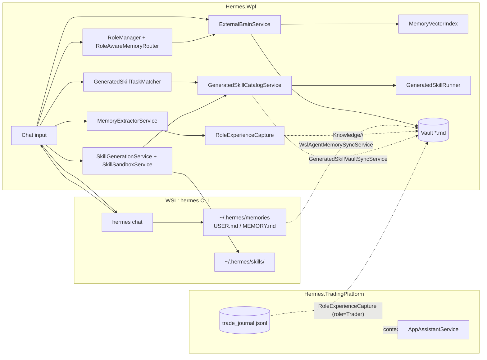

# Накопление опыта, самообучение и создание навыков в Hermes

**Дата:** 2026-05-25  
**Область:** Hermes.Wpf + WSL Hermes CLI + Hermes.TradingPlatform (точки касания).  
**Связанные документы:**
[`Docs/Report/Experience_And_Skills_Logic_Report.md`](../Docs/Report/Experience_And_Skills_Logic_Report.md),
[`Docs/Report/External_Brain_Implementation_Report.md`](../Docs/Report/External_Brain_Implementation_Report.md),
[`Trading_Platform_Learning_Touchpoints.md`](Trading_Platform_Learning_Touchpoints.md).

---

## 1. Два контура: память и навыки

В кодовой базе **«опыт»** и **«навыки»** реализованы разными подсистемами,
но они подмешиваются в один и тот же исходящий промпт Hermes.

| Контур | Цель | Где живёт | Автоматизм |
|--------|------|-----------|------------|
| **Память (External Brain)** | Длинная память: семантика, процедуры, эпизоды, identity | Markdown vault Obsidian-стиля (`*.md`) + опциональный векторный индекс | Частичный: ручное сохранение черновика; **роль-aware автозахват**; sync с WSL CLI |
| **Навыки (generated skills)** | Переиспользуемые инструменты под задачи (script / prompt / intent) | `%AppData%\HermesWpf\skills\<id>\` + зеркало `~/.hermes/skills/<id>/` | Подбор под задачу — авто; **создание нового** — только по явному `skill_save` / фразе «сохрани как навык» |



---

## 2. Память: External Brain

### 2.1. Сервис и кэш

`Hermes.Wpf/Services/ExternalBrainService.cs`

- При старте `MainViewModel` создаёт `ExternalBrainService(LogService, HermesSettings, Dispatcher)`.
- Корень vault разрешается в `ResolveEffectiveMemoryPath()` по приоритету:
  1. переменная окружения `HERMES_EXTERNAL_BRAIN_PATH`,
  2. `%AppData%\HermesWpf\externalBrain.json` (поле `MemoryPath`),
  3. `HermesSettings.ExternalBrainMemoryPath`.
- При старте и любом изменении `*.md` (`FileSystemWatcher`, debounce ≈ 450 мс)
  выполняется `ReloadFromDiskAsync` → перепарсивает все Markdown файлы в
  `ImmutableList<MemoryItem>` и пересобирает `MemoryVectorIndex`.
- Парсинг YAML frontmatter (`type`, `timestamp`, `tags`, `project`, `importance`)
  выполняет `ExternalBrainMarkdown`. Метка времени берётся из YAML, иначе из
  имени файла, иначе из `File.LastWriteTimeUtc`.

### 2.2. Подмешивание в промпт

- В `MainViewModel.ExecuteHermesUserTurnAsync` зовётся
  `BuildContextAsync(userQuery, ExternalBrainMaxContextItems)`.
- Если включён `ExternalBrainVectorRetrievalEnabled` — кандидаты идут из
  `MemoryVectorIndex.SelectTopAsync` (cosine similarity, при наличии Ollama —
  плотные эмбеддинги; fallback — TF-IDF).
- Иначе используется лексический скор `MemoryLexicalScorer`.
- Кандидаты дополнительно фильтруются и буститься `RoleAwareMemoryRouter`
  под текущую роль (см. §4).
- Получаемый блок встраивается как `--- EXTERNAL BRAIN ... ---` в исходящий
  промпт через `BuildOutboundHermesPrompt`, **не** показывается в чате.

### 2.3. UI

- Вкладка «External Brain» (`ExternalBrainWindow`, `ExternalBrainViewModel`) —
  поиск, теги, превью.
- Вкладка «WSL Memory» (`WslMemoryView`, `WslMemoryViewModel`) — просмотр
  файлов из `~/.hermes/memories/`.

---

## 3. Извлечение опыта из чата

### 3.1. Черновик (`MemoryDraft`)

`Hermes.Wpf/Services/MemoryExtractorService.cs`

После каждого успешного ответа Hermes (`MainViewModel.ExecuteHermesUserTurnAsync`):

```csharp
_lastExperienceDraft = _memoryExtractor.ExtractExperience(payload, displayResponse);
```

- Эвристики `Classify` → тип `semantic | procedural | episodic`:
  - `semantic` для вопросов «что такое / how does / explain»;
  - `episodic` если в ответе сигналы ошибки (`error`, `exception`, `timeout`);
  - `procedural` при списках / длинном ответе;
  - иначе по длине ответа.
- `ScoreImportance` — 1…5 по объёму и типу (`procedural` получает +1).
- `InferTags` — добавляет `hermes`, `chat`, тип; ловит `dotnet`/`supabase`/etc.

Сохранение черновика на диск **не** автоматическое (без RoleAutoCapture):
пользователь жмёт «Save experience» в `MemoryEditorWindow`, и сервис
кладёт `*.md` в подпапку `Knowledge/`, `Procedures/`, `Projects/` или
`Identity/` (см. `MemoryExtractorService.MemorySubfolderForType`).

### 3.2. Авто-захват по роли (`RoleExperienceCapture`)

`Hermes.Wpf/Services/RoleExperienceCapture.cs`

Это и есть «самообучение» в работающем приложении.
Условия захвата (см. `TryCaptureCore`):

1. `HermesSettings.RoleAutoCapture == true`;
2. активная роль ≠ `AgentRole.Universal`;
3. длина пары вопрос+ответ ≥ `RoleAutoCaptureMinLength` (по умолчанию 150);
4. `Importance ≥ RoleAutoCaptureMinImportance` (по умолчанию 4);
5. `draft.Type` ∈ {`procedural`, `semantic`}; `episodic` не захватывается;
6. `MemoryExtractorService.ShouldSave(draft) == true`;
7. дедупликация по SHA-256 от первых 200 символов задачи+ответа,
   окно последних 50 хэшей.

Если все условия выполнены — сервис кладёт `*.md` в `Knowledge/<Role>`:

| Роль | Папка vault | Тег |
|------|-------------|-----|
| Trader | `Knowledge/Trading` | `trading` |
| Developer | `Knowledge/Development` | `development` |
| English Tutor | `Knowledge/English` | `english` |
| Personal Manager | `Knowledge/Productivity` | `productivity` |
| Universal | (не сохраняется) | — |

После записи `ExternalBrainService.RestartWatcherAndReload("role-capture")` —
кэш и векторный индекс обновляются немедленно.

### 3.3. Where it is wired

`MainViewModel.ExecuteHermesUserTurnAsync` (упрощённо):

```csharp
_lastExperienceDraft = _memoryExtractor.ExtractExperience(payload, displayResponse);
_roleManager.RecordTurn(payload);
var vaultPath = _externalBrain.ResolveEffectiveMemoryPath();
if (_lastExperienceDraft is not null
    && await _roleExperienceCapture
        .TryCaptureAsync(_lastExperienceDraft, _roleManager.CurrentRole, vaultPath)
        .ConfigureAwait(true))
{
    _externalBrain.RestartWatcherAndReload("role-capture");
}
_chatLogService.AppendMessage(project.Name, "Hermes", displayResponse);
SyncWslAgentMemoryToVault("after-chat");
SyncPlatformKnowledgeToVault("after-chat");
_ = WslMemory.RefreshAsync();
```

---

## 4. Маршрутизация по ролям

`Hermes.Wpf/Services/RoleManager.cs`, `RoleAwareMemoryRouter.cs`,
`RoleSkillIndex.cs`.

- Роли: `Universal`, `Trader`, `Developer`, `EnglishTutor`, `PersonalManager`.
- Переключение: фразами в чате (`RoleManager.TrySwitchRoleFromMessage`,
  алиасы «trader/трейдер/трейдинг», «dev/разработчик», «english/репетитор»…),
  либо из UI настроек. При смене сохраняется `Settings.PersistedAgentRole`.
- `RoleAwareMemoryRouter` под активную роль:
  - бустит записи с «своими» тегами/папками (`trading`, `dotnet`, …),
  - штрафует «чужие» (`Trader` понижает `english`/`grammar` и т.д.),
  - нормализует score и берёт топ-N для `BuildContextAsync`.
- `RoleSkillIndex` хранит счётчики использования навыков по ролям в
  `%AppData%\HermesWpf\role-skill-index.json` и сортирует выдачу
  `GetSkillsForRole(role)` по частоте.

---

## 5. Синхронизация памяти WSL → vault

`Hermes.Wpf/Services/WslAgentMemorySyncService.cs`,
пути — `WslAgentMemoryPaths.cs`.

| Источник WSL | Папка vault | Тип |
|--------------|-------------|-----|
| `~/.hermes/memories/USER.md` | `Identity/WslAgent_USER.md` | identity |
| `~/.hermes/memories/MEMORY.md` | `Knowledge/WslAgent_MEMORY.md` | semantic |

- Триггеры (`MainViewModel.SyncWslAgentMemoryToVault`): старт приложения,
  после каждого успешного хода чата, закрытие окна Settings.
- Условия: `HermesSettings.SyncWslAgentMemoryToExternalBrain == true`,
  vault существует, файл найден через UNC `\\wsl.localhost\<distro>\home\<user>\`.
- Контент разбивается по разделителю `§` (`WslAgentMemoryPaths.SplitEntries`)
  и пишется в Markdown с YAML frontmatter. Запись идёт только если содержимое
  изменилось (`WriteIfChanged`).

---

## 6. Платформенная инструкция в vault

`Hermes.Wpf/Services/HermesPlatformKnowledgeSyncService.cs` берёт
`Docs/Report/Experience_And_Skills_Logic_Report.md` (или встроенный fallback)
и пишет копию в `Knowledge/Hermes/<имя>.md` — Hermes получает справку
о самом себе тем же ретривером, что и пользовательские заметки.

Срабатывает на старте, после чата и после закрытия Settings — параллельно
с `SyncWslAgentMemoryToVault`.

---

## 7. Навыки (generated skills)

### 7.1. Файловая раскладка

```
%AppData%\HermesWpf\skills\<id>\
  manifest.json          # GeneratedSkillManifest (id, title, kind, triggers, …)
  SKILL.md               # agentskills.io-style описание
  run.ps1 | run.py       # если kind=script
~\.hermes\skills\<id>\   # WSL-зеркало (если SkillMirrorToWslHermes=true)
%AppData%\HermesWpf\skills\index.json    # GeneratedSkillIndexService
```

`Manifest` (см. `Hermes.Wpf/Models/GeneratedSkillManifest.cs`):
`Id`, `Title`, `Summary`, `Triggers`, `Kind`(`prompt|script|intent`),
`ScriptFile`, `OutboundPromptBlock`, `TestCommand`, `Roles[]`,
`SourceTurn`, `Enabled`, `CreatedAtUtc`, `DirectoryPath`.

### 7.2. Каталог и подбор под задачу

`GeneratedSkillCatalogService` (`Skills`, `Reload`, `MatchTrigger`, `AllCards`,
`OutboundPromptBlocks`, `CompactCatalogForPrompt`, `TrySetEnabled`,
`FindById`) — единственный источник списка навыков для остальных сервисов.

`GeneratedSkillTaskMatcher.Rank(userTask, role, maxItems, minScore)`
строит TF-IDF индекс по `id + title + summary + triggers + outboundPromptBlock`,
учитывает совпадения триггеров, токенов id и концепт-affinity
(`zip/архив/запак`, `screen/скрин`). Итоговый score =
`0.55 × TF-IDF + 0.45 × lexical`, порог `SkillResolveMinScore` (0.28 по умолчанию).
Лог: `[skill-resolver] task → <id> (score=…, …)`.

Результат подаётся в исходящий промпт как блок «Skill resolver — matched
saved skills for THIS user task»; при score ≥ 0.5 Hermes
рекомендуется вернуть `{"skill":"run_generated","id":"…"}` вместо генерации
заново.

### 7.3. Локальный запуск без CLI

`MainViewModel.TryHandleGeneratedSkillLocalAsync` (см. строки ~2162–2202):

1. Явная фраза «запусти навык `<id>`» (`SkillRunTriggers`) → ищем по id и
   запускаем `GeneratedSkillRunner.RunAsync`.
2. Иначе подбор по триггеру (`GeneratedSkillCatalogService.MatchTrigger`):
   если `kind=script`, навык запускается сразу, иначе пропускается на
   обычный flow (промпт с outbound block).

`GeneratedSkillRunner`:

- `prompt`-навыки сюда не приходят — у них только `OutboundPromptBlock`.
- `script`-навыки запускаются по расширению: `.py → python "<path>"`,
  `.ps1 → powershell.exe -NoProfile -ExecutionPolicy Bypass -File`.
- stdout/stderr собираются, обрезаются до 2000 символов, идут в логи
  `[skill-run]`. Ненулевой exit-code считается провалом.
- `RunTestCommandAsync` исполняет `test_command` из манифеста (smoke).

### 7.4. Создание нового навыка (кристаллизация)

Автоматического создания «после любой удачной задачи» **нет**.
Алгоритм такой:

1. Триггер начала кристаллизации:
   - **Фраза в чате** — `SkillCrystallizeTriggers` («сохрани как навык»,
     «кристаллизуй», `save as skill`, …);
   - **Промпт** — `SkillReflectionService.CrystallizeNowBlockRu` + последние
     ~12 сообщений;
   - **Ответ Hermes** — компактный JSON `{"skill":"skill_save",…}` или блок
     `HERMES_SKILL_CRYSTALLIZE_BEGIN … END`.

2. Разбор: `SkillCrystallizeIntentParser.TryConsumeSaveIntent` →
   `SkillSavePayload`.

3. `SkillGenerationService.TrySaveAsync`:
   1. `SkillSandboxService` — запуск под лимитом времени (`SkillSandboxTimeoutSeconds`),
      regex-фильтры опасных команд; при провале сохранение прерывается.
   2. Создание директории `%AppData%\HermesWpf\skills\<id>` (или `<id>_2…` до
      `SkillMaxGenerationAttempts`).
   3. Запись `run.ps1`/`run.py` (если `script`).
   4. Запись `manifest.json` (включая `sourceTurn`) и `SKILL.md`.
   5. Зеркалирование в `~/.hermes/skills/<id>` (`SkillMirrorToWslHermes`).
   6. Если включено — `RunTestCommandAsync` для smoke-проверки.
   7. `GeneratedSkillVaultSyncService.TryExportSkill` — конспект в
      `Procedures/GeneratedSkills/Skill_<id>.md` с тегами
      `generated-skill, hermes-wpf, skill-gen`.
   8. `GeneratedSkillCatalogService.Reload()` — UI и resolver видят новый навык.

4. Ответ в чат через `SkillCrystallizeIntentParser.UserFacingSaveLine`
   («[skill] Навык «…» сохранён и прошёл smoke-тест.» и т.д.).

### 7.5. Run от Hermes

`SkillCrystallizeIntentParser.TryConsumeRunIntent` ловит
`{"skill":"run_generated","id":"…"}` в ответе и запускает `GeneratedSkillRunner.RunAsync`.
Идентификаторы проверяются по `^[a-z][a-z0-9_]{2,47}$`.

---

## 8. Сквозной сценарий: один ход чата

`MainViewModel.ExecuteHermesUserTurnAsync` (упрощённо):

1. Локальные обработчики раньше CLI: ручные торговые ордера/закрытие позиций
   (если включён режим трейдинга), flashcards, Reni Water, скриншот,
   **generated skill trigger/run**, desktop window focus, описание экрана.
2. `ExternalBrainService.BuildContextAsync` — кандидаты опыта в промпт
   (vector / lexical → role boost).
3. Подготовка hints: `EnglishTutorTurnHints`, `SkillTurnHints`
   (кристаллизация + resolver `taskMatches`).
4. `BuildOutboundHermesPrompt` склеивает: системные инструкции +
   External Brain block + Skill resolver block + Skill generation rules +
   outbound prompt blocks включённых навыков + platform knowledge block.
5. `HermesService.SendMessageAsync` → `wsl -d <distro> -- /bin/bash -lc "… hermes chat …"`.
6. Разбор ответа: сначала skill JSON (`skill_save` / `run_generated`),
   потом flashcards/Reni/TTS, иначе обычный текст.
7. Post-process: запись в чат через UI Dispatcher, добавление в
   `_chatLogService`, `MemoryExtractorService.ExtractExperience`,
   `RoleExperienceCapture.TryCaptureAsync`, `SyncWslAgentMemoryToVault("after-chat")`,
   `SyncPlatformKnowledgeToVault("after-chat")`, `WslMemory.RefreshAsync`,
   `PublishAssistantTurnToSupabaseIfPossibleAsync`,
   `TrySaveHistoryAfterTurnAsync`.

---

## 9. Настройки (`HermesSettings`)

### External Brain / память

| Параметр | По умолчанию | Эффект |
|----------|--------------|--------|
| `ExternalBrainMemoryPath` | пусто | Корень vault (если не задан env / json overlay) |
| `ExternalBrainInjectIntoPrompt` | `true` | Подмешивать ли блок в `hermes chat` |
| `ExternalBrainMaxContextItems` | 12 | Сколько заметок в блок |
| `ExternalBrainVectorRetrievalEnabled` | `true` | Включать vector retrieval |
| `SyncWslAgentMemoryToExternalBrain` | `true` | Синк `USER.md`/`MEMORY.md` из WSL |
| `RoleAutoCapture` | `true` | Авто-захват в `Knowledge/<role>/` |
| `RoleAutoCaptureMinImportance` | 4 | Минимальный importance для авто-захвата |
| `RoleAutoCaptureMinLength` | 150 | Минимальная длина (problem + solution) |

### Skill generation

| Параметр | По умолчанию |
|----------|--------------|
| `SkillGenerationEnabled` | `true` |
| `SkillMirrorToWslHermes` | `true` |
| `GeneratedSkillsDirectory` | пусто → `%AppData%\HermesWpf\skills` |
| `SkillMaxGenerationAttempts` | 3 |
| `SkillRunTestsBeforeSave` | `true` |
| `SkillSandboxBeforeSave` | `true` |
| `SkillSandboxTimeoutSeconds` | 60 |
| `SkillAutoResolveForTasks` | `true` |
| `SkillResolveMaxSuggestions` | 3 |
| `SkillResolveMinScore` | 0.28 |

Файл настроек: `%AppData%\HermesWpf\settings.json`.

---

## 10. Сводная карта файлов

### Память

| Файл | Назначение |
|------|------------|
| `Hermes.Wpf/Services/ExternalBrainService.cs` | Vault, поиск, watcher, context block |
| `Hermes.Wpf/Services/MemoryVectorIndex.cs` | TF-IDF / Ollama embeddings, `SelectTopAsync` |
| `Hermes.Wpf/Services/OllamaEmbeddingClient.cs` | Прокси к Ollama API |
| `Hermes.Wpf/Services/MemoryExtractorService.cs` | Черновик опыта из чата |
| `Hermes.Wpf/Models/MemoryDraft.cs` | DTO черновика |
| `Hermes.Wpf/Services/RoleExperienceCapture.cs` | Авто-захват по роли |
| `Hermes.Wpf/Services/RoleManager.cs` | Текущая роль, алиасы |
| `Hermes.Wpf/Services/RoleAwareMemoryRouter.cs` | Бусты/штрафы по роли |
| `Hermes.Wpf/Services/RoleSkillIndex.cs` | Usage stats навыков |
| `Hermes.Wpf/Services/WslAgentMemorySyncService.cs` | WSL → vault |
| `Hermes.Wpf/Services/WslAgentMemoryPaths.cs` | UNC-пути WSL |
| `Hermes.Wpf/Services/HermesPlatformKnowledgeSyncService.cs` | Docs/Report → vault |
| `Hermes.Wpf/Services/VaultInitializer.cs` | Раскладка папок vault |
| `Hermes.Wpf/Views/MemoryEditorWindow.xaml.cs` | Ручное сохранение черновика |
| `Hermes.Wpf/ViewModels/ExternalBrainViewModel.cs` | UI vault |
| `Hermes.Wpf/ViewModels/WslMemoryViewModel.cs` | UI WSL memories |

### Навыки

| Файл | Назначение |
|------|------------|
| `Hermes.Wpf/Services/GeneratedSkillCatalogService.cs` | Загрузка манифестов, triggers, enable/disable |
| `Hermes.Wpf/Services/GeneratedSkillTaskMatcher.cs` | Resolver под задачу (TF-IDF + лексика) |
| `Hermes.Wpf/Services/GeneratedSkillRunner.cs` | Запуск `run.ps1`/`run.py`, smoke-test |
| `Hermes.Wpf/Services/GeneratedSkillPaths.cs` | Пути Windows + UNC к WSL |
| `Hermes.Wpf/Services/GeneratedSkillIndexService.cs` | Запись `index.json` |
| `Hermes.Wpf/Services/GeneratedSkillVaultSyncService.cs` | Экспорт в `Procedures/GeneratedSkills` |
| `Hermes.Wpf/Services/SkillGenerationService.cs` | Сохранение `skill_save` + sandbox + mirror |
| `Hermes.Wpf/Services/SkillSandboxService.cs` | Запуск под таймаутом перед save |
| `Hermes.Wpf/Services/SkillCrystallizeIntentParser.cs` | Парсер `skill_save`/`run_generated` JSON |
| `Hermes.Wpf/Services/SkillCrystallizeTriggers.cs` | Фразы пользователя для кристаллизации |
| `Hermes.Wpf/Services/SkillRunTriggers.cs` | «запусти навык …» |
| `Hermes.Wpf/Services/SkillReflectionService.cs` | Reflective prompt |
| `Hermes.Wpf/Services/SkillResolverInstructions.cs` | Текст блока resolver в промпт |
| `Hermes.Wpf/Services/SkillGenerationInstructions.cs` | Правила формирования skill_save |
| `Hermes.Wpf/Models/GeneratedSkillManifest.cs` | DTO манифеста |
| `Hermes.Wpf/ViewModels/GeneratedSkillsViewModel.cs` | UI каталога |

### Оркестрация

| Файл | Назначение |
|------|------------|
| `Hermes.Wpf/ViewModels/MainViewModel.cs` | Главный обработчик хода чата (см. §8) |
| `Hermes.Wpf/Views/MainWindow.xaml.cs` | Startup-sync (`vm.SyncWslAgentMemoryToVault("startup")`, `vm.SyncPlatformKnowledgeToVault("startup")`) |

---

## 11. Самообучение: что есть и чего нет

### Есть

- **Auto-captured procedural/semantic memory по ролям** — каждый успешный ответ,
  попадающий в фильтры `RoleExperienceCapture`, сразу превращается в `*.md`
  в `Knowledge/<role>/` и переиспользуется в следующих ходах через retrieval.
- **Usage learning по навыкам** — `RoleSkillIndex` помнит, какой навык в
  какой роли использовался, и поднимает его в `GetSkillsForRole`.
- **Кристаллизация навыка** — Hermes по фразе пользователя или по reflective
  prompt сам формирует `skill_save` JSON, который проходит sandbox и
  записывается как новый исполняемый артефакт.
- **Двусторонняя память** — `USER.md`/`MEMORY.md` из WSL CLI отзеркаливаются
  в `Identity/` и `Knowledge/`, попадая в тот же ретривер.
- **Platform self-doc** — отчёт по самой WPF-платформе всегда лежит в
  `Knowledge/Hermes/` и приходит в контекст.

### Нет (vs концепция Voyager/Gemini)

| Возможность | Статус |
|-------------|--------|
| Авто-создание навыка после **любой** успешной задачи без `skill_save` | нет |
| Docker-sandbox для script-навыков | нет (только temp + timeout + regex) |
| Полноценная векторная БД (Chroma/Qdrant) | нет (`MemoryVectorIndex` поверх vault) |
| `SOUL.md` self-edit (агент правит свой профиль) | нет |
| Единый plugin host `ISkill` (рантайм-плагины) | нет |
| Episodic store отдельно от vault (Redis) | нет |
| Auto-save `MemoryDraft` в vault для роли Universal | нет (нужна явная роль или ручной save) |

---

## 12. Логи, по которым видно работу контура

| Префикс | Значение |
|---------|----------|
| `[external-brain]` | Загрузка vault, watcher, debounce |
| `[vector-memory]` | Пересборка/запрос индекса (TF-IDF или Ollama) |
| `[role-capture]` | Авто-захват в `Knowledge/<role>/` |
| `[wsl-memory-sync]` | Экспорт `USER.md`/`MEMORY.md` |
| `[platform-knowledge]` | Экспорт отчёта в vault |
| `[skill-resolver]` | Подбор навыка под задачу |
| `[skill-gen]` | Кристаллизация и запись |
| `[skill-sandbox]` | Прогон script перед save |
| `[skill-index]` | `index.json` |
| `[skill-vault]` | Экспорт навыка в `Procedures/GeneratedSkills` |
| `[skill-run]` | stdout/stderr запущенного навыка |
| `[role-manager]` / `[role-skill]` | Смена роли, usage stats навыков |

---

## 13. Кратко в одной таблице

| Шаг | Кто пишет | Что появляется |
|-----|-----------|----------------|
| Пользователь спрашивает в чате | — | новая запись в `ChatLogService`, история |
| Готов ответ Hermes | `MemoryExtractorService` | `MemoryDraft` в RAM |
| Активна роль ≠ Universal, importance ≥ 4 | `RoleExperienceCapture` | `*.md` в `Knowledge/<role>/` (procedural/semantic) |
| Завершён ход чата | `WslAgentMemorySyncService` | `Identity/WslAgent_USER.md`, `Knowledge/WslAgent_MEMORY.md` (если изменились) |
| Завершён ход чата | `HermesPlatformKnowledgeSyncService` | `Knowledge/Hermes/<отчёт>.md` |
| Пользователь сказал «сохрани как навык» | `SkillGenerationService` | `skills/<id>/{manifest.json, SKILL.md, run.*}`, vault `Procedures/GeneratedSkills/Skill_<id>.md`, опционально `~/.hermes/skills/<id>/` |
| Триггер совпал | `GeneratedSkillRunner` | `[skill-run]` лог, ответ в чат |
| Сменилась роль | `RoleManager` + `RoleSkillIndex.LoadAsync` | пересортировка skill index |

---

*Конец отчёта.*
