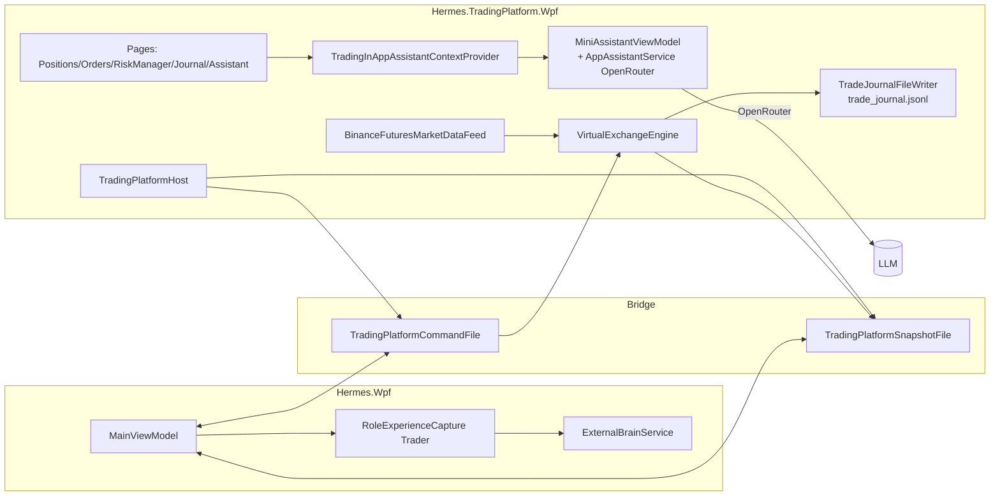

# Точки контакта Hermes.TradingPlatform с обучающим контуром

**Дата:** 2026-05-25  
**Область:** только проект `Hermes.TradingPlatform.*` и его мост в Hermes.Wpf.  
**Связанные документы:**
[`Experience_Learning_Skills.md`](Experience_Learning_Skills.md),
[`Docs/Report/Hermes_Trading_Platform_Integration.md`](../Docs/Report/Hermes_Trading_Platform_Integration.md),
[`Docs/Report/Experience_And_Skills_Logic_Report.md`](../Docs/Report/Experience_And_Skills_Logic_Report.md).

---

## 1. Архитектура: что трейдинг даёт обучению

Hermes.TradingPlatform — **отдельный WPF-процесс**, у него нет прямого
доступа к External Brain. Учится платформа двумя путями:



| Канал | Куда учим | Кто пишет |
|-------|-----------|-----------|
| **Trade journal** | `%LocalAppData%\HermesTrading\trade_journal.jsonl` — append-only фактический лог сделок | `TradeJournalFileWriter` |
| **Bridge snapshot/command** | JSON-файлы для Hermes.Wpf, чтобы видеть состояние и принимать `manual_order`, `close_position` | `TradingPlatformBridgePublisher` ↔ `TradingPlatformBridgeService` |
| **Чат с Hermes** (в обычном WPF) | RoleExperienceCapture(role=Trader) → vault `Knowledge/Trading/` | `Hermes.Wpf.MainViewModel` |
| **In-app ассистент** | OpenRouter (`Hermes.InAppAssistant`) — отвечает по live-snapshot, **не пишет** в vault | `MiniAssistantViewModel` |

---

## 2. Журнал сделок как первичный источник опыта

### 2.1. Файл и формат

`Hermes.TradingPlatform.Data.Persistence.TradeJournalFileWriter`

- Путь: `%LocalAppData%\HermesTrading\trade_journal.jsonl`.
- Формат: одна сделка — одна строка JSON (`TradeJournalEntry`):

| Поле | Описание |
|------|----------|
| `Id`, `Timestamp` | UUID и UTC-timestamp |
| `OrderId`, `Symbol`, `Side` | Привязка к ордеру и инструменту |
| `Kind` | `Open` / `Add` / `Reduce` / `Close` |
| `Quantity`, `FillPrice`, `Fee` | Исполнение |
| `RealizedPnl`, `BalanceBefore`, `BalanceAfter` | Денежный эффект |
| `ReduceOnly` | Помечает SL/TP/Reduce-only fills |

Запись синхронная, под `lock`, поток поддерживает дозапись (`Append`),
полную загрузку (`LoadAll`) и очистку (`Clear`). Кроме file-writer
есть `SqliteJournalStore` (`IJournalStore`-родственник).

### 2.2. Что это даёт обучению

- **Replay**: `JournalReplayService` + `ReplayViewModel` подставляют исторические
  сделки в paper-движок для проверки гипотез/стратегий.
- **Аналитика в UI**: `JournalViewModel` показывает все строки с фильтрами,
  RealizedPnL и комиссиями.
- **Экспорт в External Brain** делается **не напрямую** — через ход чата в
  Hermes.Wpf: пользователь обсуждает результат торговли в режиме `Trader`,
  `RoleExperienceCapture` фиксирует `procedural`/`semantic` заметку в
  `Knowledge/Trading/` (см. §4).

---

## 3. Risk Profile и авто-обучение исполнению

`Hermes.TradingPlatform.Core/Domain/RiskProfile.cs` (+
`RiskProfileSettingsDto.cs`, `RiskProfileFileStore.cs`).

Платформа теперь умеет «учиться» исполнять сделки безопасно по умолчанию:

| Поле | Назначение |
|------|------------|
| `RiskPerTradePercent` | Целевой risk % на сделку (используется для SL) |
| `DefaultTakeProfitRrMultiplier` | TP-distance = TP × SL-distance (RR) |
| `AutoApplyDefaultSlTp` | Если `true`, после открытия позиции движок прикручивает SL+TP |
| `MaxExposurePercent`, `SafeMode`, `AutoShutdown`, `EmergencyHalt` | Защитные правила |

`VirtualExchangeEngine.TryAttachDefaultSlTp` (вызывается после `FillOrder`):

1. Считает SL-distance от `RiskPerTradePercent`;
2. Создаёт reduce-only Stop-ордер (SL) и Limit-ордер (TP) c
   `Purpose ∈ {Entry, SL, TP, Reduce}`;
3. Эти ордера попадают в `OrderDto.Purpose` и в `PositionDto.StopLossPrice`,
   `PositionDto.TakeProfitPrice` через
   `TradingUiMapper.ToDto(Position, IReadOnlyList<Order>)`.

UI Risk Manager (`RiskManagerView.xaml`, `RiskManagerViewModel.cs`) даёт
редактировать TP multiplier и переключатель «Auto SL/TP при открытии».

### 3.1. Источник «опыта» — Risk validator + журнал

`IRiskValidator` (см. `RiskValidator`) ловит превышения и пишет события в
`TradeUiFeedback` и `EventLogProjection`. Эти события:

- видны в чате Hermes.Wpf через bridge snapshot,
- попадают в обсуждение, и через `RoleExperienceCapture(role=Trader)` могут
  стать `Knowledge/Trading/*.md`, если пользователь подтвердит выводы.

---

## 4. Hermes.Wpf как обучающий центр для Trader-режима

В Hermes.Wpf пользователь говорит «трейдинг»/`trading` →
`RoleManager.TrySwitchRoleFromMessage` переключает роль на `Trader`.
Что меняется:

- `RoleAwareMemoryRouter` бустит ноты с тегами
  `trading|market|strategy|pnl|position|order|risk` и пути
  `Knowledge/Trading/*`, `Procedures/Trading/*`, `Projects/Trading/*`.
- `RoleAwareMemoryRouter` штрафует `english|vocabulary|grammar`.
- `RoleExperienceCapture` начинает писать `procedural`/`semantic` заметки
  в `Knowledge/Trading/` (тег `trading`, `auto-captured`).
- `MainViewModel.ExecuteHermesUserTurnAsync` первыми пробует
  `TryHandleManualOrderLocalAsync` и `TryHandleClosePositionLocalAsync`,
  чтобы команда «открой лонг по биткоину» не уходила в desktop vision
  (см. историю чата 2026-05).
- Команды уходят на платформу через `TradingPlatformBridgeService` (файлы
  `TradingPlatformCommandFile`/`TradingPlatformSnapshotFile`), а результат
  («[trading-bridge] manual_order ok=… detail=…») пишется в `ChatLogService`
  и **именно эта пара (запрос пользователя → детализированный ответ
  системы) и есть кандидат на сохранение в `Knowledge/Trading/`** —
  фильтры `MemoryExtractorService.ScoreImportance` + `RoleAutoCaptureMinLength`
  обычно пропускают такие записи как `procedural`.

---

## 5. In-app ассистент (OpenRouter) — отдельный контур

`Hermes.TradingPlatform.Wpf/ViewModels/Shell/MainViewModel.cs`:

```csharp
var assistantContext = new TradingInAppAssistantContextProvider(() => this);
InAppAssistant = new MiniAssistantViewModel(
    new AppAssistantService(logger: new TradingAppAssistantLogger()),
    () =>
    {
        var s = _host.PlatformSettingsStore.Load();
        return new AppAssistantOptions
        {
            ApplicationId = AppAssistantKnowledge.TradingPlatformId,
            OpenRouterApiKey = s.InAppAssistantOpenRouterApiKey,
            Model = s.InAppAssistantOpenRouterModel,
        };
    },
    assistantContext);
```

| Компонент | Что делает |
|-----------|------------|
| `Hermes.InAppAssistant/AppAssistantService.cs` | Прямой вызов OpenRouter chat completions |
| `Hermes.InAppAssistant/AppAssistantKnowledge.cs` | Системные промпты для `hermes-wpf` и `hermes-trading-platform` |
| `TradingInAppAssistantContextProvider` | Снимок состояния (страница, account, PnL, OpenPositionsCount, статус Hermes orchestration) для system prompt |
| `TradingAppAssistantLogger` | Перенаправляет логи ассистента в `TradingPlatformFileLogger` |

Это **отдельный** от External Brain канал. Он:

- не пишет в vault и не запускает skills;
- ограничен «in-app helper only — you do not execute trades»;
- получает live snapshot платформы как факт «прямо сейчас».

Самообучения в этом контуре **нет** — это retrieval-augmented helper
с фиксированной базой знаний (`HermesWpfDoc` / `TradingPlatformDoc` в
`AppAssistantKnowledge`).

---

## 6. Market data feed — диагностика и самонастройка

`Hermes.TradingPlatform.Exchange/MarketData/BinanceFuturesMarketDataFeed.cs`

В мае 2026 фид перестроили на гибридную схему:

1. **WebSocket `/ws`** — `SUBSCRIBE` к `@bookTicker` (mid-цена) и `@ticker` (24h).
2. **REST poller `Poll24hrStatsLoopAsync`** — раз в минуту дотягивает
   `ChangePercent24h` и `QuoteVolume24h` из `/fapi/v1/ticker/24hr`,
   если WS-`@ticker` не пришёл.
3. `_diagnosticLog` — расширенное логирование (первый тик, ошибки, состояние
   подписки) через `TradingPlatformFileLogger`.

Это **операционное** обучение — фид сам выбирает наиболее надёжный источник,
не записывая в External Brain. Однако диагностические сообщения попадают в
`Logs` UI и могут обсуждаться в чате Hermes.Wpf, что снова замыкается на
`RoleExperienceCapture` для роли Trader.

---

## 7. Сводная таблица: где «учится» трейдинг-платформа

| Уровень | Артефакт | Файл | Как используется |
|---------|----------|------|------------------|
| Сделки | `trade_journal.jsonl` | `TradeJournalFileWriter` | Replay, Journal UI, аналитика PnL |
| Состояние | `session_state.json` | `TradingSessionStateFileStore` | Восстановление позиций/ордеров после перезапуска |
| Snapshot для Hermes | `bridge\snapshot.json` | `TradingPlatformSnapshotFile` | Hermes.Wpf видит платформу |
| Команды от Hermes | `bridge\command.json` | `TradingPlatformCommandFile` | manual_order, close_position |
| Risk-profile | `risk_profile.json` | `RiskProfileFileStore` | SL/TP defaults, лимиты |
| Settings | `platform_settings.json` | `PlatformSettingsFileStore` | Источник котировок, OpenRouter API key |
| Логи | `TradingPlatformFileLogger` сессионные файлы | `Logs` UI | Диагностика, обсуждаются в Hermes.Wpf |

---

## 8. Самообучение в трейдинге: что есть и чего нет

### Есть

- **Auto SL/TP** — движок сам прикручивает защитные ордера по rules из
  Risk Manager (см. §3).
- **Auto-capture** для Trader-роли в Hermes.Wpf (`RoleExperienceCapture` →
  `Knowledge/Trading/`).
- **Replay** на исторических данных журнала.
- **Hermes-bridge**: команды чата уходят в платформу, результаты возвращаются
  и становятся материалом для memory extractor.
- **Hybrid Binance feed** — REST дополняет WebSocket, без потери данных при
  частичных потерях стрима.

### Нет

| Возможность | Статус |
|-------------|--------|
| Auto-generate trading skill после серии прибыльных сделок | нет (только ручная кристаллизация в Hermes.Wpf) |
| Reinforcement learning над `trade_journal.jsonl` | нет |
| Прямая запись из платформы в External Brain | нет (через bridge → Hermes.Wpf → Capture) |
| Self-edit для RiskProfile | нет (только пользователь через UI) |
| Online-tuning стратегий | нет (стратегии конфигурируются вручную) |

---

## 9. Где смотреть в логах

| Источник | Префиксы |
|----------|----------|
| Hermes.TradingPlatform (`TradingPlatformFileLogger`) | `[exchange]`, `[market-data]`, `[bridge]`, `[risk]`, `[journal]`, `[assistant]` |
| Hermes.Wpf при работе с трейдингом | `[trading-bridge]`, `[role-manager]`, `[role-capture]`, `[external-brain]` |
| OpenRouter ассистент | `[openrouter-assistant]` |

---

## 10. Резюме

- Платформа **сама не пишет** в External Brain; она генерит факты (журнал,
  риск-события, market data), которые становятся учебным материалом, когда
  пользователь обсуждает их в чате Hermes.Wpf в роли `Trader`.
- Учебный цикл закрывается через мост и через `RoleExperienceCapture`.
- Внутри платформы есть точечное «само-исполнение» (Auto SL/TP, REST fallback
  для котировок), но это операционные правила, а не обучение в смысле
  External Brain.
- In-app ассистент — самостоятельный helper, не часть обучения.

---

*Конец отчёта.*
