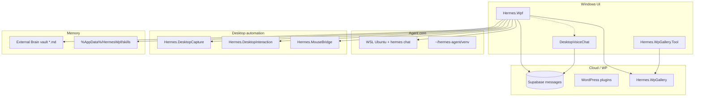

# Обзор структуры проекта Hermes

**Дата:** 2026-05-20  
**Репозиторий:** `D:/Programming/AI_Agents/Hermes`

Репозиторий **Hermes** — экосистема вокруг AI-агента **Hermes CLI** (WSL/Ubuntu): Windows-клиент, захват рабочего стола, память, навыки, синхронизация с Supabase и WordPress.

Единого `.sln` нет: несколько связанных **.NET 8** проектов и отдельные папки с документацией и плагинами.



---

## Корневые каталоги

| Папка | Назначение |
|--------|------------|
| **Hermes.Wpf** | Главное приложение — чат, проекты, настройки, External Brain, навыки, Supabase relay |
| **Hermes.DesktopCapture** | Захват экрана, разметка окон/regions, PNG+JSON |
| **Hermes.DesktopInteraction** | UI-автоматизация (клики, фокус окон) |
| **Hermes.MouseBridge** | Отдельный exe для мыши; копируется в output WPF |
| **Hermes.WpGallery** | Библиотека REST/WebSocket для галереи на WordPress |
| **Hermes.WpGallery.Tool** | WPF-утилита загрузки скриншотов/логов на сайт |
| **Source/DesktopVoiceChat** | Ранний голосовой клиент + Supabase (источник credentials) |
| **Source/WordPressGallery** | Документация/заготовки галереи |
| **Docs** | Отчёты, инструкции для Cursor/Claude/Gemini, планы |
| **WordPressPlugins** | ZIP и исходники плагинов (`hermes-image-receiver`, screenshots) |
| **scripts** | PowerShell (например `reni_water` — расписание воды) |
| **Images/Hermes** | Примеры захватов экрана (PNG, regions, JSON) |
| **Reports** | Отчёты по логам подключения |

---

## Hermes.Wpf — центр системы

**Стек:** WPF, MVVM, .NET 8, пакет **Supabase**.

| Слой | Содержимое |
|------|------------|
| **Views/** | `MainWindow`, `ChatWindow`, `SettingsWindow`, `ExternalBrainWindow`, `AgentSkillsView`, `SetupWizard`, тест Supabase |
| **ViewModels/** | `MainViewModel` (оркестрация), `SettingsViewModel`, `ExternalBrainViewModel`, `GeneratedSkillsViewModel` |
| **Services/** | WSL/Hermes, подключение, логи, External Brain, vector memory, flashcards, generated skills, bilingual Supabase, gallery |
| **Skills/** | `FlashcardSkill`, `DesktopVisionSkill`, `ReniWaterScheduleSkill` |
| **Models/** | `HermesSettings`, `MemoryItem`, `SupabaseMessageRow`, манифесты навыков |

### Ключевые потоки

- **Чат** → `HermesService` → `wsl -d Ubuntu … hermes chat`
- **Память** → vault Markdown + `MemoryVectorIndex` (TF-IDF / Ollama)
- **Навыки** → `%AppData%\HermesWpf\skills\` + skill resolver / `skill_save`
- **Supabase** → `SupabaseChatRelayService` + `BilingualSegmentFormatter` (en/ru для Android TTS)
- **Скриншот** → `Hermes.DesktopCapture` → vision через Hermes

### Пути рантайма

| Что | Где |
|-----|-----|
| Настройки | `%AppData%\HermesWpf\settings.json` |
| Логи сессии | `%AppData%\HermesWpf\logs\hermes_session_*.log` |
| Лог чата | `%LocalAppData%\HermesWpf\chat_logs\` |
| Generated skills | `%AppData%\HermesWpf\skills\` |
| Зеркало skills (WSL) | `~/.hermes/skills/` |

---

## Вспомогательные библиотеки

| Проект | Роль |
|--------|------|
| **Hermes.DesktopCapture** | Мониторы, окна, `ScreenCapturePipeline`, аннотации regions |
| **Hermes.DesktopInteraction** | Низкоуровневое взаимодействие с UI Windows |
| **Hermes.MouseBridge** | Мост для навыка мыши |
| **Hermes.WpGallery** | Клиент API галереи Hermes на WordPress |
| **Hermes.WpGallery.Tool** | Tray/UI для публикации снимков (собирается рядом с WPF) |

---

## Документация (`Docs/`)

| Документ | Тема |
|----------|------|
| [Instructions/start.md](Instructions/start.md) | Концепция WPF ↔ WSL |
| [Instructions/Gemini/persistent_memory_skill_g.md](Instructions/Gemini/persistent_memory_skill_g.md) | Память и навыки (актуально для WPF) |
| [Report/Experience_And_Skills_Logic_Report.md](Report/Experience_And_Skills_Logic_Report.md) | Полный отчёт по опыту и skills |
| [Report/External_Brain_Implementation_Report.md](Report/External_Brain_Implementation_Report.md) | External Brain vault |
| [Report/Hermes_Current_Implementation_Report.md](Report/Hermes_Current_Implementation_Report.md) | Сводный отчёт о реализации проекта |
| [Report/Hermes_Trading_Platform_Integration.md](Report/Hermes_Trading_Platform_Integration.md) | Интеграция Wpf ↔ Trading Platform |
| [Plans/UI_Automation_and_Agent_Skills.md](Plans/UI_Automation_and_Agent_Skills.md) | План UI automation |
| [Report/Hermes_Connection_Implementation_And_Logs_Report.md](Report/Hermes_Connection_Implementation_And_Logs_Report.md) | Подключение WSL/Hermes |

Инструкции для разных ассистентов: `Docs/Instructions/Claude_Instructions/`, `ChatGPT_Instructions/`, `Gemini/`.

---

## Внешние интеграции

| Система | Как связана |
|---------|-------------|
| **Hermes CLI (WSL)** | `hermes chat`, venv, workspace по проекту |
| **Supabase** | Таблица `messages`, relay, flashcards, bilingual JSON |
| **WordPress** | Плагины приёма изображений, English Flashcards |
| **Obsidian-style vault** | External Brain (`*.md`), WSL `~/.hermes/memories/` |
| **Android voice client** | Читает `content` с полями `ru` / `en` из Supabase |
| **DesktopVoiceChat** | Общий Supabase URL/key (миграция в WPF settings) |

---

## Скрипты и прочее

- **scripts/reni_water/** — напоминания о воде, scheduled tasks, скриншоты.
- **WordPressPlugins/** — дистрибутивы и исходники PHP-плагинов.
- **Images/Hermes/** — артефакты тестов desktop capture (не код).

---

## Зависимости сборки (упрощённо)

```
Hermes.Wpf
 ├── Hermes.DesktopCapture
 ├── Hermes.DesktopInteraction
 ├── Hermes.WpGallery
 ├── Hermes.MouseBridge (exe в output)
 └── Hermes.WpGallery.Tool (exe в output)
```

**DesktopVoiceChat** и **Source/** — отдельно, без ProjectReference из WPF; логически связаны через Supabase и общие сценарии.

---

## Где начать читать код

1. `Hermes.Wpf/ViewModels/MainViewModel.cs` — чат, Supabase, flashcards, промпты.
2. `Hermes.Wpf/Services/HermesService.cs` — вызов WSL.
3. `Hermes.Wpf/Services/ExternalBrainService.cs` — долгосрочная память.
4. `Hermes.Wpf/Services/BilingualSegmentFormatter.cs` — формат для Android TTS.
5. [Report/Experience_And_Skills_Logic_Report.md](Report/Experience_And_Skills_Logic_Report.md) — поведение памяти и навыков.

---

*Конец обзора.*
