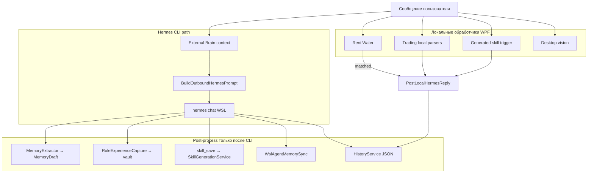

# 01. Обзор архитектуры

## Три типа «навыков» в Hermes.Wpf

В кодовой базе смешаны три разных понятия, которые пользователь может называть «навыком»:

| Тип | Примеры | Хранение | Кто исполняет |
|-----|---------|----------|---------------|
| **Built-in local skills** | Reni Water, flashcards, desktop vision, trading local parsers | C# в `Hermes.Wpf`, скрипты в репозитории | `MainViewModel` — **до** вызова Hermes CLI |
| **Generated skills** | Пользователь/агент сохранил решение через `skill_save` | `%AppData%\HermesWpf\skills\{id}\` | `GeneratedSkillRunner` + опционально Hermes CLI |
| **Hermes CLI skills** | Навыки upstream Hermes agent в WSL | `~/.hermes/skills/` | `hermes chat` в Ubuntu |

**Reni Water** относится к первому типу. Документация на вкладке «Навыки» (`AgentSkillsCatalog`) — **справочная**, не runtime-реестр.

---

## Два контура обучения

### Опыт (memory)

Цель — долгосрочные заметки в Markdown vault (Obsidian-стиль): процедуры, факты, эпизоды.

Ключевые классы:

- `ExternalBrainService` — загрузка `*.md`, поиск, injection в промпт
- `MemoryExtractorService` — эвристический черновик после ответа Hermes CLI
- `RoleExperienceCapture` — условная auto-запись в vault по роли
- `WslAgentMemorySyncService` — односторонний импорт `USER.md` / `MEMORY.md` из WSL

### Навыки (generated skills)

Цель — переиспользуемые инструменты с триггерами, скриптами и prompt-блоками.

Ключевые классы:

- `SkillGenerationService` — сохранение после `skill_save` JSON от модели
- `GeneratedSkillCatalogService` — каталог на диске
- `GeneratedSkillTaskMatcher` — ранжирование навыков под задачу пользователя
- `SkillSandboxService` — проверка script-навыков перед сохранением

**Автоматического «выучил задачу → создал навык» нет.** Кристаллизация требует явной просьбы пользователя и корректного JSON в ответе модели.

---

## Схема одного хода чата

**Критический разрыв:** ветка `LocalReply` (Reni Water, trading status, generated skill run) **не** вызывает `ExtractExperience`, `RoleExperienceCapture`, `SyncWslAgentMemoryToVault`.

---

## Режимы чата и их влияние

| Режим | Settings | Влияние на опыт/навыки |
|-------|----------|------------------------|
| **Общий агент** | `TradingModeEnabled=false`, `AssistantModeEnabled=false` | Полный pipeline Hermes CLI + memory + skills |
| **Trading mode** | `TradingModeEnabled=true` | CLI получает persona трейдера + futures snapshot; Reni Water **не блокируется**, но LLM смещён к трейдингу |
| **Assistant mode** | `AssistantModeEnabled=true` | OpenRouter напрямую — **без** External Brain, memory extraction, skill_save |
| **English tutor** | `EnglishTutorModeEnabled=true` | Свой persona; client capabilities скрыты |

Для бытовых задач (водоканал) оптимален **общий режим агента** с подключённым External Brain. Trading mode не отключает Reni Water, но ухудшает ответы LLM на вопросы вне трейдинга.

---

## Точки входа в коде

| Действие | Файл | Метод |
|----------|------|-------|
| Оркестрация хода | `Hermes.Wpf/ViewModels/MainViewModel.cs` | `ExecuteHermesUserTurnAsync` |
| Сборка промпта | `MainViewModel.cs` | `BuildOutboundHermesPrompt` |
| Reni Water | `MainViewModel.cs` | `TryHandleReniWaterLocalAsync` |
| Черновик опыта | `MainViewModel.cs` | после `HermesService.SendMessageAsync` (~L2293) |
| Локальный ответ | `MainViewModel.cs` | `PostLocalHermesReply` |
