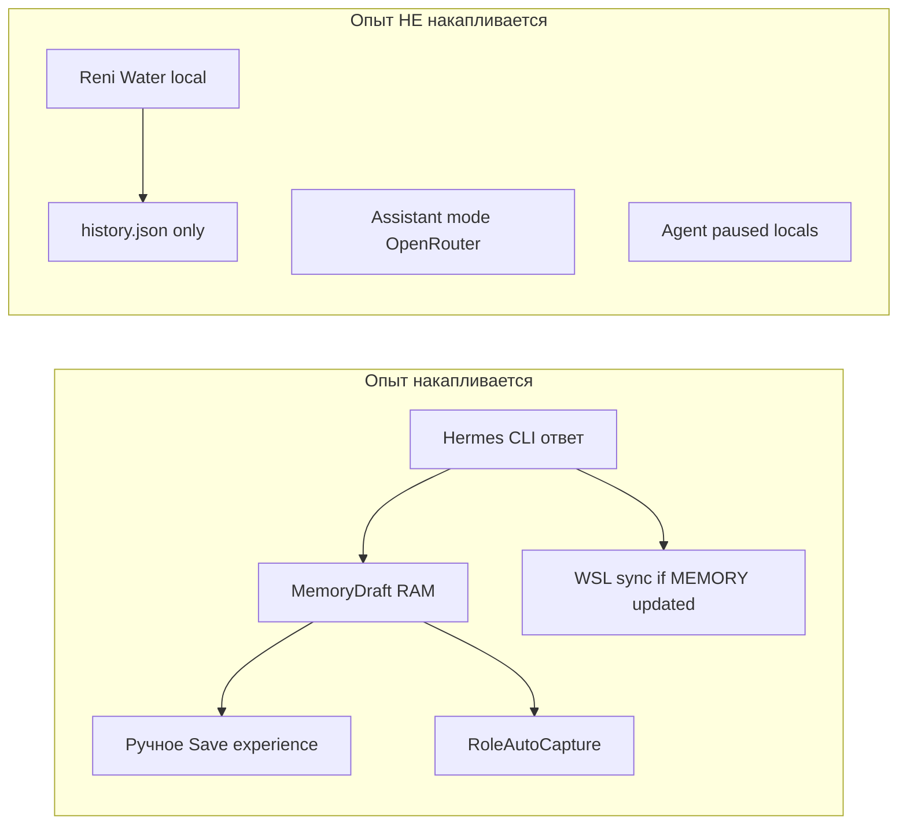

# 02. Накопление опыта

## Уровни памяти

| Уровень | Реализация | Участвует в «памяти агента»? |
|---------|------------|------------------------------|
| **Сессия UI** | `Chat.Messages`, `ChatLogService` | Только текущий проект; не retrieval |
| **История на диск** | `%LocalAppData%\HermesWpf\history\{project}.json` | Восстановление UI; используется в `SkillReflectionService` (12 последних сообщений для кристаллизации) |
| **External Brain vault** | `*.md` recursive | **Да** — vector/lexical search → промпт |
| **WSL agent memory** | `~/.hermes/memories/USER.md`, `MEMORY.md` | **Да** — после sync в vault |
| **Черновик в RAM** | `_lastExperienceDraft` | До ручного сохранения или role auto-capture |
| **Настройки Reni Water** | `settings.json` keys `ReniWater*` | **Нет** для LLM — только для WPF scheduler |

---

## External Brain

**Сервис:** `Hermes.Wpf/Services/ExternalBrainService.cs`

### Путь к vault (приоритет)

1. Env `HERMES_EXTERNAL_BRAIN_PATH`
2. `%AppData%\HermesWpf\externalBrain.json` → `{ "MemoryPath": "..." }`
3. `HermesSettings.ExternalBrainMemoryPath`

**Текущее состояние (типичная установка):** `ExternalBrainMemoryPath` часто **пуст** → vault не подключён → блок `--- EXTERNAL BRAIN ---` **не попадает** в промпт, даже при `ExternalBrainInjectIntoPrompt=true`.

### Retrieval

| Режим | Setting | Механизм |
|-------|---------|----------|
| Vector | `ExternalBrainVectorRetrievalEnabled` | `MemoryVectorIndex` — Ollama embeddings или TF-IDF fallback |
| Lexical | vector off | Token overlap по content/tags/filename |

`RoleAwareMemoryRouter` может boost/filter по активной роли (`PersonalManager` → `Knowledge/Productivity`).

### Injection

Вызывается в `ExecuteHermesUserTurnAsync`:

```csharp
var brainBlock = await _externalBrain.BuildContextDetailedAsync(payload, maxItems);
// → BuildOutboundHermesPrompt(..., brainBlock, ...)
```

Блок **не виден** пользователю в пузыре чата.

---

## MemoryExtractorService

**Файл:** `Hermes.Wpf/Services/MemoryExtractorService.cs`

После **успешного** ответа Hermes CLI:

```csharp
_lastExperienceDraft = _memoryExtractor.ExtractExperience(payload, displayResponse);
```

### Классификация (эвристики, не LLM)

| Тип | Признаки |
|-----|----------|
| `semantic` | «что такое», «как работает», explain-ish |
| `episodic` | error/failed/timeout в ответе |
| `procedural` | списки, «шаг N», длинные инструкции |
| `identity` | (редко) |

`ScoreImportance`: 1–5 по длине и типу.  
`ShouldSave`: суммарная длина problem+solution ≥ 24 символов.

**Сам по себе не пишет на диск** — только `_lastExperienceDraft` в памяти приложения.

### Ручное сохранение

UI «Save experience» → `MemoryEditorWindow` → файл в vault:

```
{vault}/Procedures|Knowledge|Projects|Identity/{yyyy-MM-dd_HH-mm}_{type}.md
```

---

## RoleExperienceCapture

**Файл:** `Hermes.Wpf/Services/RoleExperienceCapture.cs`

Auto-save в vault **только если все условия**:

| Условие | Default |
|---------|---------|
| `RoleAutoCapture == true` | settings |
| Роль ≠ `Universal` | — |
| `Importance >= RoleAutoCaptureMinImportance` | **4** |
| Длина content ≥ `RoleAutoCaptureMinLength` | **150** |
| Тип = `procedural` или `semantic` | episodic **не** сохраняется |
| Dedup SHA256 (50 последних в RAM) | — |

### Папки по ролям

| Роль | Vault subfolder |
|------|-----------------|
| Trader | `Knowledge/Trading/` |
| Developer | `Knowledge/Development/` |
| EnglishTutor | `Knowledge/English/` |
| **PersonalManager** | **`Knowledge/Productivity/`** |
| Biohacker | `Health/Journal/` |

Для водоканала логична роль **PersonalManager**, но auto-capture сработает только если ответ Hermes CLI длинный и procedural/semantic — **не** при локальной передаче показаний.

---

## WSL memory sync

**Сервис:** `WslAgentMemorySyncService.cs`

| WSL файл | Vault destination |
|----------|-------------------|
| `USER.md` | `Identity/WslAgent_USER.md` |
| `MEMORY.md` | `Knowledge/WslAgent_MEMORY.md` |

Триггеры: startup, `after-chat`, settings save.  
Setting: `SyncWslAgentMemoryToExternalBrain` (default true).

**Ограничение:** односторонний snapshot целых файлов; Reni Water в WSL memory **не появится**, если агент CLI не записал это в MEMORY.md.

---

## Что происходит при локальном Reni Water

`PostLocalHermesReply` (используется Reni Water, trading status, manual orders):

```csharp
Chat.Messages.Add(...);
_chatLogService.AppendMessage(...);
TrySaveHistoryAsync(projectName);  // JSON history only
// НЕТ: ExtractExperience, RoleCapture, WslSync, ExternalBrain update
```

**Итог:** успешная передача показаний **не создаёт** запись опыта ни в vault, ни в черновике, ни в WSL memory.

---

## Диаграмма: когда опыт накапливается



---

## Применимость к водоканалу

| Сценарий | Накопление опыта |
|----------|-----------------|
| «Передай показания» → скрипт OK | **Нет** (local handler) |
| «Как настроить водоканал?» → Hermes CLI длинный ответ | Черновик + возможный auto-capture (PersonalManager) |
| Заметка в vault вручную «Procedures/ReniWater.md» | **Да** — retrieval в следующих CLI-ходах |
| Запись в WSL MEMORY.md агентом | **Да** — после sync |

Без явной записи в vault или MEMORY.md агент **не «помнит»** настройку водоканала между сессиями.
