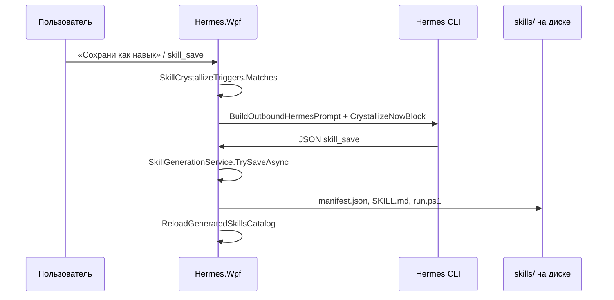

# 03. Создание навыков агентом

## Обзор pipeline

Generated skills — отдельная подсистема от built-in Reni Water.



---

## Включение и settings

| Setting | Назначение | Default |
|---------|------------|---------|
| `SkillGenerationEnabled` | Master switch | см. settings.json |
| `SkillAutoResolveForTasks` | Matcher в промпт | — |
| `SkillResolveMaxSuggestions` | Top-N навыков | — |
| `SkillResolveMinScore` | Порог для подсказки модели | — |
| `GeneratedSkillsDirectory` | Пусто → `%AppData%\HermesWpf\skills` | — |
| `SkillMirrorToWslHermes` | Зеркало в `~/.hermes/skills/` | — |
| `SkillSandboxBeforeSave` | Валидация script перед save | — |
| `SkillRunTestsBeforeSave` | Smoke test `test_command` | — |

---

## Триггеры кристаллизации (пользователь)

**Класс:** `SkillCrystallizeTriggers.cs`

Примеры фраз: «сохрани как навык», «закристаллизуй», `skill_save`, regex `(сохран|кристал|crystall).{0,40}(навык|skill)`.

При match → `SkillTurnHints.CrystallizeRequested = true` → в промпт добавляется `SkillReflectionService.CrystallizeNowBlockRu` (экспорт последних ~12 сообщений чата).

---

## Формат skill_save

**Инструкции:** `SkillGenerationInstructions.OutboundBlockRu`  
**Парсер:** `SkillCrystallizeIntentParser.cs`

```json
{
  "skill": "skill_save",
  "id": "snake_case_id",
  "title": "Краткое имя",
  "summary": "1–2 предложения",
  "triggers": ["фраза1", "фраза2"],
  "kind": "script|prompt|intent",
  "script_body": "...",
  "script_extension": "ps1|py",
  "outbound_prompt_block": "инструкция для будущих чатов",
  "test_command": "опционально"
}
```

Альтернатива: маркеры `HERMES_SKILL_CRYSTALLIZE_BEGIN` … `END`.

Запуск сохранённого: `{"skill":"run_generated","id":"..."}`.

---

## SkillGenerationService.TrySaveAsync

**Файл:** `Hermes.Wpf/Services/SkillGenerationService.cs`

1. Проверка `SkillGenerationEnabled`
2. Sandbox для `kind=script` (`SkillSandboxService`)
3. Запись в `%AppData%\HermesWpf\skills\{id}\`:
   - `manifest.json`
   - `SKILL.md`
   - `run.ps1` / `run.py`
4. Опционально WSL mirror
5. Опционально smoke test
6. Export в vault: `Procedures/GeneratedSkills/Skill_{id}.md`
7. `ReloadGeneratedSkillsCatalog()` → index.json + bulk vault sync

---

## Подбор навыков под задачу (resolver)

**Класс:** `GeneratedSkillTaskMatcher.cs`

При `SkillAutoResolveForTasks`:

```csharp
taskMatches = _skillTaskMatcher.Rank(payload, _roleManager.CurrentRole, ...);
```

Результат → `SkillResolverInstructions.TaskMatchBlockRu` в промпте: модель должна предложить `run_generated` при score ≥ порога.

**RoleSkillIndex** фильтрует навыки по роли.

---

## Локальное исполнение generated skill

**Метод:** `TryHandleGeneratedSkillLocalAsync` в `MainViewModel.cs`

- Срабатывает **после** Reni Water, **до** Hermes CLI
- Только **script**-навыки с matching trigger
- `kind=prompt|intent` — через Hermes CLI и JSON `run_generated`

Порядок в `ExecuteHermesUserTurnAsync`:

```
flashcards → Reni Water → trading locals → desktop → GeneratedSkillLocal → Hermes CLI
```

---

## Built-in vs generated: сравнение

| | Reni Water (built-in) | Generated skill |
|--|----------------------|-----------------|
| Создание | Разработчик, фиксированный код | Пользователь + `skill_save` |
| Триггеры | `ReniWaterSubmitTriggers` (C#) | `manifest.triggers` |
| Исполнение | `ReniWaterScriptService` | `GeneratedSkillRunner` |
| Расписание | `ReniWaterScheduleSkill` + Windows Task Scheduler | Нет (unless scripted) |
| Vault export | Нет | `Procedures/GeneratedSkills/` |
| Prompt block | **Нет** | `outbound_prompt_block` |

---

## Может ли агент «выучить» водоканал как generated skill?

**Теоретически да**, если пользователь:

1. Включит `SkillGenerationEnabled`
2. Попросит «сохрани как навык» после описания процедуры
3. Модель вернёт валидный `skill_save` с Playwright/ps1 телом

**Практически:**

- Встроенный Reni Water **не заменяется** — это параллельные пути
- Дублирование логики и конфликт триггеров («передай показания» → built-in перехватит **раньше** generated)
- Кристаллизация **не происходит автоматически** после успешной передачи

---

## Skill generation и режимы

| Режим | skill_save обрабатывается? |
|-------|---------------------------|
| Hermes CLI (общий агент) | **Да** |
| Trading mode + CLI | **Да**, но persona смещена к трейдингу |
| Assistant mode (OpenRouter) | **Нет** — bypass CLI pipeline |
| Local handlers (Reni, trading) | **Нет** — до CLI не доходит |

---

## Файловая структура generated skill

```
%AppData%\HermesWpf\skills\
├── index.json
└── {id}/
    ├── manifest.json
    ├── SKILL.md
    └── run.ps1 | run.py

~/.hermes/skills/{id}/          (mirror, optional)

{vault}/Procedures/GeneratedSkills/Skill_{id}.md
```

---

## Логи и диагностика

| Маркер | Значение |
|--------|----------|
| `[skill-gen] user requested skill crystallization` | Триггер кристаллизации |
| `[skill-gen] reflective crystallization block appended` | Блок в промпт |
| `[skill-resolver]` / catalog reload | После save |
| `[role-capture]` | Auto memory (не skill) |

Generated skills **не** логируются как `[reni-water]` — разные подсистемы.
