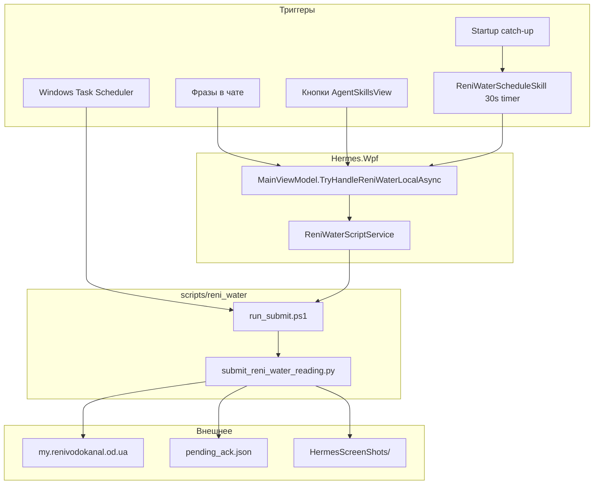

# 04. Кейс-стади: Reni Water (водоканал)

## Назначение

Встроенная автоматизация передачи показаний на `https://my.renivodokanal.od.ua` для жителей Рени (Одесская область).

**Два режима работы:**

1. **По запросу** — фраза в чате или кнопка на вкладке «Навыки»
2. **По расписанию** — in-app scheduler и/или Windows Task Scheduler

---

## Архитектура



---

## Компоненты C#

| Компонент | Путь | Роль |
|-----------|------|------|
| `ReniWaterScriptService` | `Services/ReniWaterScriptService.cs` | PowerShell wrapper, parse stdout |
| `ReniWaterScheduleSkill` | `Skills/ReniWaterScheduleSkill.cs` | Monthly / once / catch-up |
| `ReniWaterSubmitTriggers` | `Services/ReniWaterSubmitTriggers.cs` | Submit + login phrases |
| `ReniWaterAckTriggers` | `Services/ReniWaterAckTriggers.cs` | «принял», «понял» + pending |
| `ReniWaterScheduleParser` | `Services/ReniWaterScheduleParser.cs` | Расписание из текста |
| `AgentSkillsCatalog` | `Services/AgentSkillsCatalog.cs` | Справочная карточка «Быт» |

---

## Триггеры чата

### Submit (немедленная передача)

`ReniWaterSubmitTriggers.MatchesSubmit`:

- Прямые: «передай показания», «показания воды», «водоканал показания»
- Технические: `run_submit`, `reni_water`
- Контекст + глагол: водоканал/reni/показан + передай/submit/…

**Не срабатывает на:**

- «**Ты передавал** показания?» — прошедшее время, вопрос
- «Когда последний раз передавали?» — без глагола submit и без «расписание»

### Расписание

`ReniWaterScheduleParser`:

| Action | Пример фразы |
|--------|--------------|
| Monthly | «передавать показания каждый месяц», «с 1-го по 5-е» |
| Once | «передай показания завтра в 09:00» |
| Cancel | «отмени расписание показаний» |
| Status | «**расписание** показаний **когда**» / «статус» |

### Ack

После submit Python пишет `pending_ack.json`. Пользователь: «принял», «понял», «ok».

---

## Settings (`HermesSettings`)

| Key | Default | Назначение |
|-----|---------|------------|
| `ReniWaterScriptDirectory` | `...\scripts\reni_water` | Путь к скриптам |
| `ReniWaterPendingAckPath` | `d:\Documents\Utilities\water\pending_ack.json` | Флаг ожидания подтверждения |
| `ReniWaterPendingPollMinutes` | 15 | Обновление status bar |
| `ReniWaterScheduleKind` | `""` | `monthly` / `once` / пусто=выкл |
| `ReniWaterNextRunLocal` | null | ISO для one-shot |
| `ReniWaterMonthlyWindowStartDay` | 1 | Окно месяца |
| `ReniWaterMonthlyWindowEndDay` | 5 | Окно месяца |
| `ReniWaterScheduleHour` | 9 | Час запуска |
| `ReniWaterScheduleMinute` | 0 | Минута |
| `ReniWaterLastMonthlyRunKey` | null | `"yyyy-MM"` последней успешной передачи |

Persist: `%AppData%\HermesWpf\settings.json`.

---

## Скрипты

| Файл | Назначение |
|------|------------|
| `run_submit.ps1` | Entry: venv, `-login`, `-Ack`, `-CheckSession` |
| `submit_reni_water_reading.py` | Playwright: копирует «Показник на початок місяця» → «Новий показник» |
| `register_scheduled_tasks.ps1` | `Hermes_ReniWater_MonthlySubmit`, `Hermes_ReniWater_HourlyNotify` |
| `notify_pending.ps1` | Напоминание если pending ack |
| `reni_water.env` | `RENI_LOGIN_*` (gitignored) |

Stdout markers: `SESSION_OK`, `SUBMIT_ACCEPTED`, `AUTH_REQUIRED`, `Screenshot: ...`

---

## UI

- **Навыки:** `Views/AgentSkillsView.xaml` — вход, проверка сессии, передача, ack
- **Чат:** `Views/ChatView.xaml` — status bar при pending, кнопки скриншота и ack

---

## Порядок в ExecuteHermesUserTurnAsync

```
1. TryHandleLocalFlashcardsViewMode
2. TryHandleReniWaterLocalAsync          ← водоканал
3. [trading] TryHandleManualOrderLocalAsync
4. [trading] TryHandleClosePositionLocalAsync
5. TryHandleDesktopScreenCaptureLocalAsync
6. TryHandleGeneratedSkillLocalAsync
7. ... → Hermes CLI
```

Reni Water **не блокируется** trading mode, но выполняется **до** торговых locals.

---

## Связь с накоплением опыта

| Событие | Memory pipeline |
|---------|-----------------|
| Успешный submit через local handler | **Обход** — только `PostLocalHermesReply` + history JSON |
| Настройка расписания через chat | Local reply — **без** ExtractExperience |
| Вопрос «ты передавал?» → Hermes CLI | ExtractExperience **да**, но контент от LLM без знания Reni |
| Scheduled submit (timer) | Только terminal log `[reni-water]` |

**Настройки `ReniWater*` не инжектятся в промпт Hermes CLI.**

---

## Связь с skill generation

| Вопрос | Ответ |
|--------|-------|
| Reni Water в `GeneratedSkillCatalog`? | **Нет** |
| Может ли matcher предложить reni_water? | **Нет** — не в catalog |
| Перехват «передай показания» | Built-in **раньше** generated skill с тем же trigger |
| AgentSkillsCatalog в промпте? | **Нет** — только UI documentation |

---

## Почему агент «не помнит» (реконструкция инцидента)

Сообщение: *«Ты передавал показания счетчика в водоканал?»*

1. Не match submit/schedule/ack triggers → **не** local handler
2. `TradingModeEnabled=true` → persona трейдера + futures snapshot в промпт
3. `ExternalBrainMemoryPath=""` → нет vault context
4. `HermesWpfClientCapabilitiesRu` **не упоминает** Reni Water
5. Hermes CLI отвечает как generic assistant: «нет доступа к ЖКХ»

**Факт:** WPF мог передавать показания через скрипт — но это **не часть памяти LLM**.

---

## Два планировщика (важно не путать)

| | In-app (`ReniWaterScheduleSkill`) | Windows Task Scheduler |
|--|--------------------------------|------------------------|
| Где настраивается | Фразы в чате, settings | `register_scheduled_tasks.ps1` |
| Требует WPF запущен | **Да** (timer 30s) | **Нет** (1-е число 09:00) |
| Catch-up при старте WPF | **Да** | Нет |
| State | `ReniWaterScheduleKind`, `LastMonthlyRunKey` | Отдельно от settings |

Оба могут coexist; состояние **не синхронизируется** автоматически между ними.

---

## Диагностика

| Лог | Где |
|-----|-----|
| `[reni-water] Запуск передачи…` | Terminal WPF |
| `[reni-water] schedule monthly…` | Session log |
| `[reni-water] startup catch-up` | Session log |
| stdout `SUBMIT_ACCEPTED` | Terminal |

Логи Reni **не** в `Logs/Hermes.Wpf/` отдельным файлом — маркер `[reni-water]` в session log.

Проверка состояния:

- `settings.json` → `ReniWaterScheduleKind`, `ReniWaterLastMonthlyRunKey`
- `pending_ack.json` → ожидание ack
- `HermesScreenShots/` → скриншоты submit
