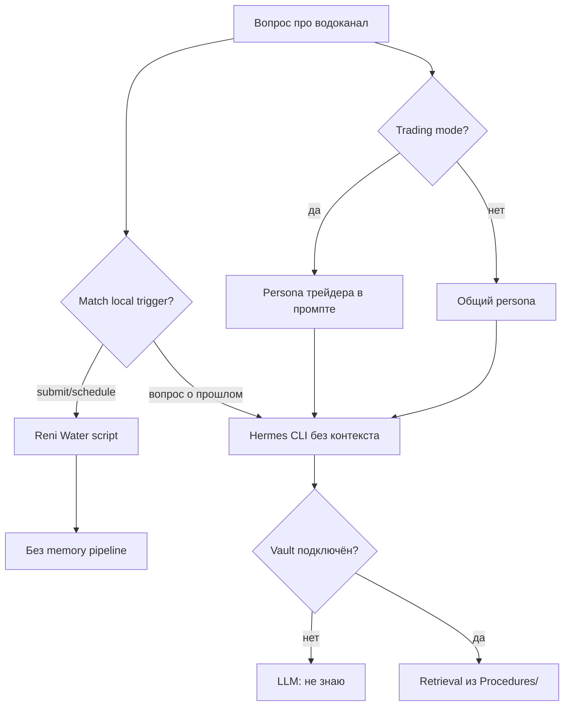

# 05. Пробелы и рекомендации

## Сводная таблица пробелов

| # | Пробел | Влияние на водоканал |
|---|--------|----------------------|
| 1 | Local handlers не вызывают `ExtractExperience` | Успешные submit не попадают в опыт |
| 2 | Reni Water не описан в outbound prompt | LLM не знает о возможности клиента |
| 3 | `AgentSkillsCatalog` — только UI, не промпт | Карточка «Быт» не доходит до модели |
| 4 | External Brain часто не подключён | Нет долгосрочной памяти о настройке |
| 5 | Settings `ReniWater*` не inject в промпт | Агент не видит расписание/last run |
| 6 | Trading mode persona | Смещает ответы LLM away от бытовых задач |
| 7 | Нет auto skill crystallize после задачи | Навык не создаётся сам после успеха |
| 8 | Два scheduler (WPF vs Windows) | Путаница «настроено или нет» |
| 9 | Вопросы о прошлом не match triggers | «Ты передавал?» уходит в CLI без контекста |
| 10 | Assistant mode bypass | OpenRouter без memory/skills вообще |

---

## Матрица: что работает для водоканала

| Задача | Built-in Reni | Experience | Generated skill | Hermes CLI memory |
|--------|---------------|------------|-----------------|-------------------|
| Передать сейчас | ✅ | ❌ | ❌ (перехват) | ❌ |
| Расписание monthly | ✅ | ❌ | ❌ | ❌ |
| Статус расписания | ✅ local | ❌ | ❌ | ❌ |
| «Ты передавал раньше?» | ❌ | ❌ | ❌ | ❌ без vault |
| Обучить новую процедуру | ❌ | ⚠️ manual | ⚠️ manual crystallize | ⚠️ MEMORY.md |

---

## Рекомендации (по приоритету)

### P0 — быстрые улучшения без смены архитектуры

#### 1. Блок Reni Water в outbound prompt

Добавить в `ChatBehaviorDefaults.HermesWpfClientCapabilitiesRu` или отдельный `ReniWaterInstructions.OutboundBlockRu`:

- клиент Hermes.Wpf умеет передавать показания локально (без CLI);
- фразы-триггеры;
- для статуса: «расписание показаний когда»;
- не утверждать «нет доступа к водоканалу», если пользователь спрашивает — предложить команды или кнопки «Навыки».

Inject **независимо** от trading mode (как client capability).

#### 2. Локальный handler «вопросы о водоканале»

Расширить `TryHandleReniWaterLocalAsync`:

- «ты передавал», «когда последний раз», «настроено ли» → ответ из `settings.json` + `ReniWaterLastMonthlyRunKey` + `pending_ack.json` + `_reniWaterSchedule.DescribeSchedule()`
- **без** Hermes CLI

#### 3. Подключить External Brain

Записать процедуру в vault:

```
Procedures/ReniWater_Setup.md
```

С `ExternalBrainMemoryPath` → retrieval в CLI-ходах.

---

### P1 — интеграция с memory pipeline

#### 4. Post-local experience hook

После успешного `RunReniWaterSubmitUiAsync` создавать **структурированный** episodic draft:

```csharp
// pseudo
_memoryExtractor.ExtractExperience("Reni water submit", chatLine);
// или прямой write в vault Procedures/
```

Минимум: append в `%LocalAppData%\HermesWpf\history` metadata или отдельный `reni_water_journal.jsonl`.

#### 5. Inject schedule snapshot в промпт (optional block)

При non-empty `ReniWaterScheduleKind` добавлять в system block:

```
Reni Water: schedule=monthly, window=1-5, lastRun=2026-05, pending=true
```

---

### P2 — навыки и роли

#### 6. Роль PersonalManager для бытовых задач

При фразах про водоканал/ЖКХ предлагать switch role или auto-boost `Knowledge/Productivity` в retrieval.

#### 7. Не дублировать через generated skill

Документировать: **не** crystallize второй «reni water» skill — конфликт триггеров. Generated skills — для **новых** процедур, не для built-in.

#### 8. Экспорт built-in catalog в vault

`HermesPlatformKnowledgeSyncService` — добавить секцию Built-in Skills (Reni Water summary) в `Knowledge/Hermes/Platform.md`.

---

### P3 — архитектурные

#### 9. Unified «local skill registry»

Единый интерфейс `ILocalSkill` с:

- triggers
- `TryHandleAsync`
- `BuildPromptBlock()`
- `GetStatusForUser()`

Reni Water, trading parsers, flashcards — implementors.

#### 10. Assistant mode parity

Если Assistant mode (OpenRouter) — минимум inject client capabilities + optional brain block.

---

## Влияние режимов (итог)



---

## Чеклист для пользователя (сейчас)

1. **Передача:** «Передай показания» или кнопка «Навыки»
2. **Расписание:** «Передавать показания каждый месяц с 1-го по 5-е»
3. **Статус:** «Расписание показаний — статус»
4. **Память для агента:** записать в External Brain + указать `ExternalBrainMemoryPath`
5. **Trading questions:** «режим агента» перед бытовыми вопросами к LLM
6. **Windows scheduler:** `register_scheduled_tasks.ps1` если WPF не всегда запущен

---

## Связь с backlog

Пункты отчёта можно добавить в `Docs/Plans/BinanceDemoFutures_Review_Backlog.ru.md` **или** отдельный `AssistantMode_Backlog.ru.md`:

- [ ] Reni Water outbound block
- [ ] Local Q&A handler (history/status)
- [ ] Post-submit experience journal
- [ ] Schedule snapshot in prompt
- [ ] ILocalSkill refactor (optional)

---

## Заключение

Реализация **передачи показаний в водоканал** в Hermes — зрелая **локальная автоматизация** (Playwright + scheduling + UI). Подсистемы **накопления опыта** и **создания навыков агентом** к ней **не подключены by design**: successful path обходит Hermes CLI, а learning pipeline завязан на CLI-ответы и явную кристаллизацию.

Агент «не помнит» водоканал не потому что «забыл обучение», а потому что:

1. Reni Water — built-in WPF skill вне memory/skills catalog;
2. Local success не пишет опыт;
3. Prompt не описывает capability;
4. Vault часто пуст;
5. Trading mode усугубляет для LLM-ветки.

Минимальный fix для UX: **local status handler + prompt block + vault note**. Полноценная интеграция: **post-local journal + unified local skill registry**.
