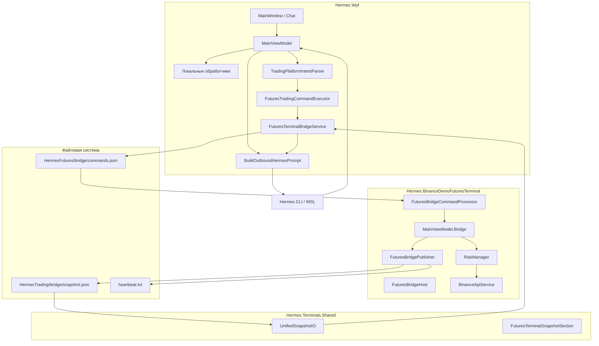

# 01. Обзор архитектуры

## Компоненты

## Роли процессов

| Процесс | Ответственность |
|---------|-----------------|
| **Hermes.Wpf** | Чат, режимы, промпт, парсинг ответа агента, постановка команд в очередь, ожидание результата |
| **Hermes.BinanceDemoFuturesTerminal** | UI терминала, REST/WebSocket к Binance Demo, риск-менеджер, исполнение bridge-команд, публикация snapshot |
| **Hermes CLI (WSL)** | LLM-агент; получает расширенный промпт, возвращает текст + опционально JSON |

## Два корня bridge на диске

| Путь | Назначение |
|------|------------|
| `%LocalAppData%\HermesTrading\bridge\` | Unified snapshot + heartbeat (общий для spot/futures/trading platform) |
| `%LocalAppData%\HermesFutures\bridge\` | Очередь команд Demo Futures (`commands.json`, `result-{id}.json`) |

Классы: `UnifiedBridgePaths`, `FuturesBridgePaths` в `Hermes.Terminals.Shared/Bridge/`.

## Режимы чата (приоритет)

`HermesChatModeResolver.ResolveModeId` — один активный режим:

1. Flashcards (если цикл активен)  
2. Assistant (`AssistantModeEnabled`)  
3. **Trading** (`TradingModeEnabled`)  
4. English Tutor  
5. Agent (общий)

Режим трейдинга **конкурирует** с Assistant и English Tutor: при включении trading assistant отключается; tutor при входе снимает trader-роль.

## Ключевые файлы

| Область | Путь |
|---------|------|
| Точка входа turn | `Hermes.Wpf/ViewModels/MainViewModel.cs` → `ExecuteHermesUserTurnAsync` |
| Сборка промпта | `BuildOutboundHermesPrompt` |
| Bridge service | `Hermes.Wpf/Services/FuturesTerminalBridgeService.cs` |
| Bridge host (терминал) | `Hermes.BinanceDemoFuturesTerminal/Bridge/FuturesBridgeHost.cs` |
| Snapshot DTO | `Hermes.Terminals.Shared/Bridge/FuturesTerminalBridge.cs` |
