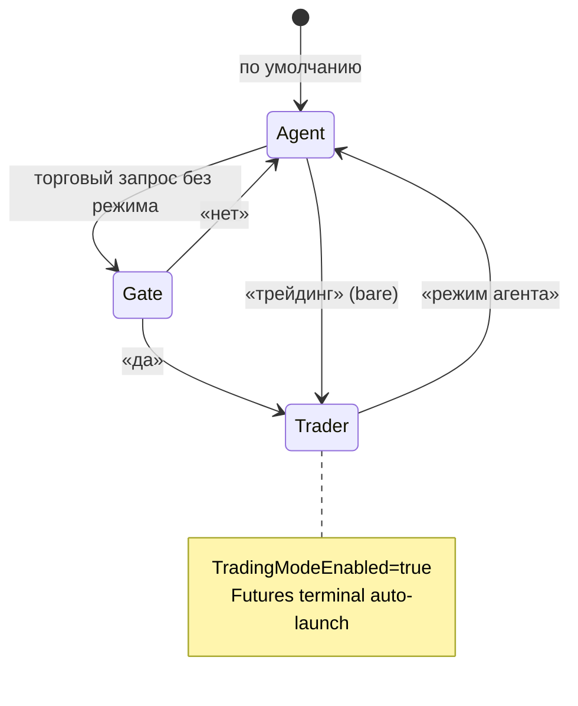

# 02. Включение и выключение режима

## Персистентное состояние

| Поле | Файл | Описание |
|------|------|----------|
| `TradingModeEnabled` | `Hermes.Wpf/Models/HermesSettings.cs` | Флаг режима трейдинга |
| `PersistedAgentRole` | тот же | При роли `Trader` trading включается автоматически |

Сохранение: `%LocalAppData%\HermesWpf\settings.json` через `SettingsService`.

## Связь с системой ролей

`MainViewModel.ApplyAgentRoleToLegacySettings`:

- `AgentRole.Trader` → `TradingModeEnabled = true`
- Другие роли → trading выключается (если не переключено явно)

`RoleManager.TrySwitchRoleFromMessage` — смена роли из текста пользователя.

## Фразы-триггеры (клиент)

Класс: `Hermes.Wpf/Services/TradingModeTriggers.cs`

| Действие | Примеры фраз |
|----------|--------------|
| **Включить** | `трейдинг`, `trading` (bare или с хвостом) |
| **Выключить** | `режим агента`, `agent mode`, `общий режим агента` |
| **Подтвердить gate** | `да`, `yes`, `трейдинг` (после вопроса о переключении) |
| **Отклонить gate** | `нет`, `no` |

Bare-команды (без торговой задачи в той же строке):

- `IsBareEnableCommand` — только «трейдинг» / «trading»
- `IsBareAgentModeCommand` — только «режим агента»

## Точки обработки в MainViewModel

### 1. Локальное переключение без LLM

`TryHandleBareModeSwitchLocal` — ответ из `HermesModeAcknowledgments` (`TradingModeActivated` / `AgentModeActivated`).

### 2. Gate в общем режиме

Если trading **выключен**, но `TradingTaskDetector.IsTradingRelated(message)`:

`TryHandleTradingModeGateLocal` → вопрос «Переключиться в режим трейдинга?» → отложенный payload до «да».

### 3. После ответа Hermes

В `ExecuteHermesUserTurnAsync`:

- `tradingDisableRequested` (`MatchesDisable`) → `SwitchRole(Universal)`
- `tradingEnableRequested` (`MatchesEnable`) → `SwitchRole(Trader)`, `EnsureTutorDisabledForTrading`

### 4. Property TradingModeEnabled

При `true`:

- Отключается assistant mode
- `EnsureFuturesTerminalRunning(force: true)` — автозапуск терминала

## UI

| Элемент | Где |
|---------|-----|
| Лента «Режим: трейдинг» | `StatusIndicator.xaml`, `TradingModeStatusRibbonText` |
| Кнопка Binance Futures | `MainWindow.xaml` → ручной запуск терминала |
| Строка режима в чате | `HermesChatModeResolver.BuildChatStatusLine` |

## Конкуренты режима

| Режим | Взаимодействие |
|-------|----------------|
| **AssistantModeEnabled** | Setter в MainViewModel сбрасывает trading |
| **EnglishTutorModeEnabled** | `EnsureTradingDisabledForTutor` при входе в tutor |
| **Flashcards** | Имеют приоритет в `ResolveModeId` |

## Диаграмма переключения

