# 03. Промпт и контекст для агента

## Точка сборки

`MainViewModel.BuildOutboundHermesPrompt` — формирует **скрытый** контекст для `hermes chat`. Пользователь в UI видит только свой текст; блоки промпта не попадают в пузырь чата.

## Блоки при TradingModeEnabled == true

Порядок добавления (упрощённо):

| # | Блок | Источник |
|---|------|----------|
| 0 | Приоритет инструкций, capabilities | `ChatBehaviorDefaults`, `HermesPlatformKnowledgeInstructions` |
| 1 | External Brain (опц.) | `ExternalBrainService.BuildContextDetailedAsync` |
| 2 | ROLE CONTEXT (опц.) | `RoleContextBlockService` |
| 3 | **Персона трейдера** | `TradingModePromptDefaults.ActivePersonaRu` |
| 4 | **Узкий scope хода** | `TradingQueryIntentClassifier` → `ScopeInstructionForTurn` |
| 5 | **Инструкции bridge** | `FuturesTerminalInstructions.OutboundBlockRu` |
| 6 | **Live snapshot** | `FuturesTerminalBridgeService.BuildFuturesContextBlockRu` |
| 7 | **Правила безопасности** | `TradingSafetyRulesInstructions.BuildOutboundBlockRu` |
| 8 | Spot (опц.) | `SpotTerminalInstructions` + snapshot spot |

## Персона трейдера

Файл: `Hermes.Wpf/Services/TradingModePromptDefaults.cs`

Содержание `ActivePersonaRu`:

- роль **трейдер-исполнитель** на USDT-M Futures Demo;
- пользователь пишет простым языком;
- торговые команды → JSON `skill:trading`, `market:futures`;
- JSON **скрыт** от пользователя — клиент показывает «Команда отправлена» / «Результат»;
- статусные вопросы → **только текст**, без JSON;
- выход: «режим агента».

## Инструкции bridge

Файл: `Hermes.Wpf/Services/FuturesTerminalInstructions.cs`

Ключевые правила для LLM:

- объём **всегда в USDT** — поле `quantity_usdt`;
- если объём не указан — `min(DefaultAgentOrderUsdt, MaxOrderNotionalUsdt, AvailableUsdt, headroom)` из snapshot;
- таблица синонимов фраз → JSON;
- пример JSON: `place_order`, `close_position`, `set_leverage`;
- перед JSON — проверка блока «Дополнительная защита агента».

## Узкий scope запроса

`TradingQueryIntentClassifier.Classify(userMessage)`:

| Intent | Поведение агента |
|--------|------------------|
| `BalanceOnly` | Одна строка с балансом USDT |
| `AccountSummary` | Структурированная сводка |
| `General` | Без дополнительного scope-блока |

## Snapshot в промпте

`AppendFuturesTerminalSnapshotBlocks` → читает `UnifiedSnapshotIO` → `BuildFuturesContextBlockRu`.

Если snapshot пуст, но интеграция включена — fallback-текст «дождитесь обновления bridge».

Пример строк в snapshot-блоке:

```
Symbol: BTCUSDT | WS: connected | Price: 73900 ...
Max margin: 1% (~739 USDT nom. @ 10x) | Risk: on
Exposure: 0/2000 USDT | Available: 73900 USDT | Wallet: 73900 USDT | Daily PnL: +12.50 USDT
**Позиции** / **Открытые ордера** / **Балансы**
```

## Правила безопасности агента

Файл: `Hermes.Wpf/Services/TradingSafetyRulesInstructions.cs`

- Текст хранится в `HermesSettings.TradingSafetyRulesText` (Settings → Трейдинг).
- **Не** External Brain / MEMORY.md — подставляется **на каждый ход** trading mode.
- Пустое поле → блок не добавляется.

Логика «строже побеждает»:

```
effective_limit = min(правило_из_текста, лимит_из_snapshot)
```

Агент должен:

1. Сверять ордер с текстом **и** snapshot (`MaxOrderMarginPercent`, `DailyRealizedPnlUsdt`, …).
2. При нарушении — **не отправлять JSON**, объяснить на русском.
3. Не блокировать `close_position` / `close_all_positions` из-за дневного убытка.
4. Предупреждать, если настройки терминала выглядят неадекватно (например 5% маржи при правиле 1%).

## Режим без trading (guard)

`TradingModePromptDefaults.NormalModeGuardRu`:

- запрет JSON `skill:trading`;
- при торговом запросе — предложить переключиться («трейдинг» / «trading»).

Snapshot futures может всё равно инжектиться, если `FuturesTerminalIntegrationEnabled`.

## Диаграмма промпта

```mermaid
flowchart LR
    UserMsg[Сообщение пользователя] --> Classify[TradingQueryIntentClassifier]
    Classify --> Persona[ActivePersonaRu]
    Persona --> Instr[FuturesTerminalInstructions]
    Instr --> Snap[BuildFuturesContextBlockRu]
    Snap --> Safety[TradingSafetyRulesInstructions]
    Safety --> Hermes[hermes chat outbound]
```


