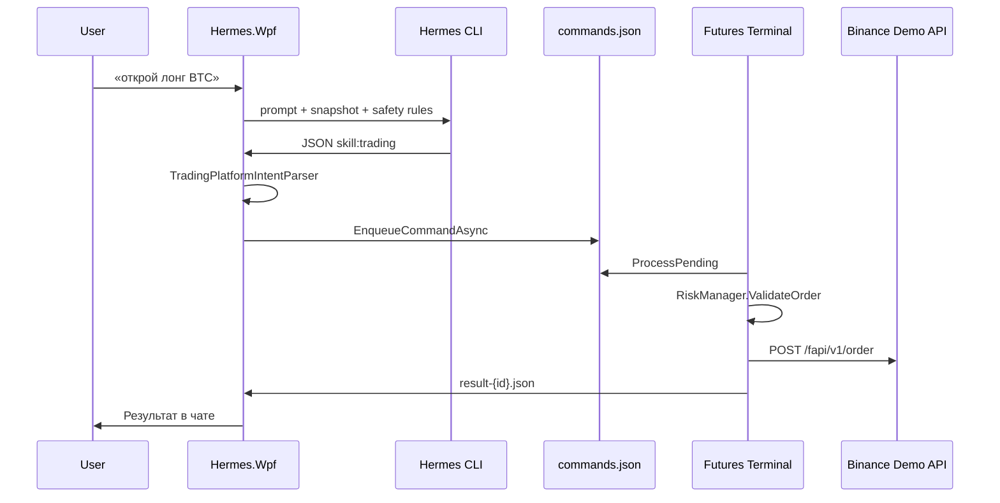

# 04. Исполнение торговых команд

## Два пути к исполнению

| Путь | Когда | LLM |
|------|-------|-----|
| **Локальный** | Распознана типовая фраза | Нет |
| **Через агента** | Сложный/неоднозначный запрос | Да |

Оба сходятся в `FuturesTradingCommandExecutor.ExecuteAsync`.

## Путь через агента

### 1. Ответ Hermes

`ExecuteHermesUserTurnAsync` получает `response` от CLI.

### 2. Парсинг JSON

`TradingPlatformIntentParser.TryConsumeIntent(response, out command, out queryOnly, out market)`:

- перебирает JSON-кандидаты в тексте ответа;
- `skill` должен быть `"trading"`;
- `action == "query"` → `queryOnly = true` (исполнение **не** выполняется; snapshot уже был в промпте);
- иначе → `TradingPlatformCommand`.

DTO: `Hermes.TradingPlatform.Shared/Bridge/TradingPlatformCommand`

Поля: `Action`, `Symbol`, `Side`, `OrderType`, `QuantityUsdt`, `Price`, `ReduceOnly`, `Leverage`, `Market`.

### 3. Маршрутизация рынка

`MainViewModel.ShouldRouteTradingToFutures(market, action)`:

- `market: futures` или close/leverage → **Futures Terminal**;
- иначе при включённом spot → Spot Terminal.

### 4. UI feedback

До исполнения:

`TradingExecutionMessages.FormatCommandSent` → пузырь «Команда отправлена…»

После:

`TradingExecutionMessages.FormatCommandResult` → «Результат…» (с USDT, PnL при close).

### 5. FuturesTradingCommandExecutor

Файл: `Hermes.Wpf/Services/FuturesTradingCommandExecutor.cs`

```text
EnsureTerminalReadyAsync(force: true)
  → MapAction (place_order, cancel_order, close_position, close_all_positions, set_leverage)
  → FuturesPlatformCommand
  → EnqueueCommandAsync
  → WaitResultAsync (20s / 75s для close)
  → ParseResultBody (FuturesPlatformCommandResultFile)
```

### 6. Bridge (Hermes.Wpf)

`FuturesTerminalBridgeService`:

| Метод | Действие |
|-------|----------|
| `EnsureTerminalReadyAsync` | Запуск exe, ожидание heartbeat ≤ 12 с + snapshot |
| `EnqueueCommandAsync` | Append в `FuturesBridgePaths.CommandsFile` |
| `WaitResultAsync` | Poll `result-{commandId}.json` |
| `TryReadFuturesSection` | Чтение `FuturesTerminal` из unified snapshot |

### 7. Bridge (терминал)

| Компонент | Файл |
|-----------|------|
| Host | `FuturesBridgeHost.cs` |
| Poll (1 с) | `FuturesBridgeCommandProcessor.ProcessPending` |
| Execute | `MainViewModel.ExecuteBridgeCommandAsync` |
| Place order | `ExecuteBridgePlaceOrderAsync` |
| Publish | `FuturesBridgePublisher` → snapshot + heartbeat |

### 8. Исполнение на бирже

`ExecuteBridgePlaceOrderAsync`:

1. Resolve `quantity_usdt` / default с учётом `RiskBasedQuantityCalculator` логики терминала;
2. `OrderVolumeUsdtHelper.CapNotionalUsdt`;
3. Конвертация USDT → контракты;
4. `BinanceApiService.PlaceOrderAsync` / stop через Algo API;
5. `RiskManager.ValidateOrder` (если не reduce-only);
6. `RefreshAccountDataAsync` → новый snapshot.

## Формат JSON для агента (пример)

```json
{
  "skill": "trading",
  "market": "futures",
  "action": "place_order",
  "symbol": "BTCUSDT",
  "side": "BUY",
  "order_type": "MARKET",
  "quantity_usdt": 50
}
```

Закрытие:

```json
{
  "skill": "trading",
  "market": "futures",
  "action": "close_position",
  "symbol": "BTCUSDT",
  "order_type": "MARKET"
}
```

## Таймауты ожидания результата

| Action | Timeout |
|--------|---------|
| place_order, cancel, set_leverage | 20 с |
| close_position, close_all_positions | 75 с (poll PnL) |

## Sequence diagram


