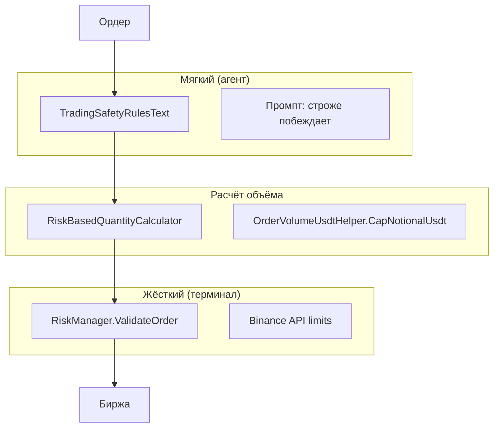

# 06. Уровни риск-контроля

Риск в режиме трейдинга — **многослойный**. Слои не дублируют друг друга полностью: каждый следующий может быть строже или жёстче предыдущего.



## Уровень 1 — Правила безопасности агента (soft)

| | |
|--|--|
| **Где** | Промпт: `TradingSafetyRulesInstructions` |
| **Хранение** | `HermesSettings.TradingSafetyRulesText` → `settings.json` |
| **Механизм** | LLM **сам** решает не отправлять JSON |
| **Надёжность** | Зависит от модели; не gate в коде |

**Назначение:** дополнительная защита, если в риск-менеджере терминала ошибочно выставлен высокий лимит (например 5% маржи вместо 1%).

**Правило:** `effective = min(текст, snapshot)` — текст может быть **строже** терминала.

**Исключения:** закрытие позиций не блокируется из-за дневного убытка / whitelist.

## Уровень 2 — Расчёт объёма в Hermes.Wpf

### RiskBasedQuantityCalculator

Файл: `Hermes.Wpf/Services/RiskBasedQuantityCalculator.cs`

Используется когда:

- локальный парсер не получил объём от пользователя;
- агент не указал `quantity_usdt` (косвенно через инструкции).

```
defaultUsdt = min(
  DefaultAgentOrderUsdt,
  MaxOrderNotionalUsdt,
  AvailableUsdt,
  MaxTotalExposureUsdt - CurrentExposureUsdt
)
```

Читает `FuturesTerminalSnapshotSection` из unified snapshot.

## Уровень 3 — Риск-менеджер терминала (hard)

Файл: `Hermes.BinanceDemoFuturesTerminal/Services/RiskManager.cs`

Настройки: `PlatformSettings` в терминале (Settings → Риск-менеджер).

| Проверка | Поле | Описание |
|----------|------|----------|
| Маржа на сделку | `MaxOrderMarginPercent` | % от депозита USDT |
| Макс. номинал | `ComputeMaxOrderNotionalUsdt` | маржа × плечо |
| Суммарная экспозиция | `MaxTotalExposureUsdt` | по всем позициям |
| Число позиций | `MaxOpenPositions` | новые символы |
| Плечо | `MaxLeverage` | информационная проверка |

`ValidateOrder` вызывается:

- при ручном ордере в UI терминала;
- при условных ордерах;
- при `ExecuteBridgePlaceOrderAsync` (через UI path).

**Маржа ордера** = `номинал / плечо`, сравнивается с `wallet × MaxOrderMarginPercent / 100`.

## Уровень 4 — Bridge cap объёма

`OrderVolumeUsdtHelper.CapNotionalUsdt` в `ExecuteBridgePlaceOrderAsync`:

- обрезает `quantity_usdt` до `MaxOrderNotionalUsdt` из риск-менеджера **до** отправки на API.

## Сводная таблица

| Сценарий | Агент | Hermes.Wpf calc | RiskManager |
|----------|-------|-----------------|-------------|
| «1% маржи» в тексте, 5% в терминале | Отказ / урезание до 1% | Cap до 5% nom. | Пропуск до 5% |
| Объём не указан | Инструкция min(...) | Default USDT | Validate при place |
| Дневной убыток > лимита в тексте | Отказ на open | — | Может пропустить open |
| close_position | Разрешено | — | reduce-only на API |

## Рекомендация для пользователя

- **Числовые лимиты** — в риск-менеджере терминала (гарантия на бирже).
- **Поведенческие правила** («не шортить», «пауза после стопов») — в тексте правил агента.
- При расхождении настроек агент **должен предупредить**, но финальный барьер — `RiskManager`.

## Связанные файлы терминала

| Файл | Роль |
|------|------|
| `Models/PlatformSettings.cs` | Default 1% margin, exposure 2000 USDT |
| `ViewModels/SettingsViewModel.cs` | UI сохранения |
| `Services/OrderVolumeUsdtHelper.cs` | USDT formatting, cap, contracts |
| `ViewModels/MainViewModel.Bridge.cs` | Default qty для bridge без volume |
