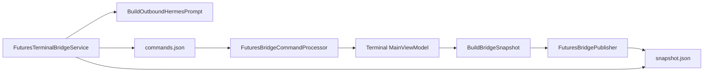

# 07. Bridge и snapshot

## Файловая IPC-схема

```text
%LocalAppData%/
├── HermesTrading/bridge/
│   ├── snapshot.json      ← unified (spot + futures + …)
│   └── heartbeat.txt      ← ISO timestamp UTC
└── HermesFutures/bridge/
    ├── commands.json      ← очередь команд Wpf → Terminal
    ├── heartbeat.txt      ← дублируется терминалом
    └── result-{guid}.json ← результат одной команды
```

Классы путей:

- `Hermes.Terminals.Shared/Bridge/UnifiedBridgePaths.cs`
- `Hermes.Terminals.Shared/Bridge/FuturesBridgePaths.cs`

## Unified snapshot

Файл: `snapshot.json`  
Структура: `UnifiedTerminalSnapshotFile` → секция `FuturesTerminal`.

IO: `UnifiedSnapshotIO.Read` / `Write`.

Терминал пишет через `FuturesBridgePublisher.PublishNow` (~каждые несколько секунд и после команд).

Hermes.Wpf читает через `FuturesTerminalBridgeService.TryReadFuturesSection`.

## Heartbeat

- Терминал обновляет `heartbeat.txt` с `DateTimeOffset.UtcNow`.
- `IsTerminalAlive`: разница **< 12 секунд** → терминал считается живым.
- `EnsureTerminalReadyAsync`: launch exe + poll до готовности.

## Очередь команд

### FuturesPlatformCommand

`Hermes.Terminals.Shared/Bridge/FuturesTerminalBridge.cs`

| Поле | Тип | Описание |
|------|-----|----------|
| `Id` | Guid | ID команды |
| `Action` | string | place_order, close_position, … |
| `Symbol` | string? | BTCUSDT |
| `Side` | string? | BUY / SELL |
| `OrderType` | string? | MARKET / LIMIT |
| `QuantityUsdt` | decimal? | Номинал в USDT |
| `Quantity` | decimal? | Legacy: контракты |
| `Price` | decimal? | LIMIT |
| `ReduceOnly` | bool? | |
| `Leverage` | int? | set_leverage |

### FuturesPlatformCommandResultFile

| Поле | Описание |
|------|----------|
| `Success` | bool |
| `Message` | Текст для чата |
| `RealizedPnlUsdt` | PnL после close (poll) |

## FuturesTerminalSnapshotSection — поля

Определение: `FuturesTerminalBridge.cs`  
Заполнение: `MainViewModel.BuildBridgeSnapshot()` (`MainViewModel.Bridge.cs`)

| Поле | Источник |
|------|----------|
| `TerminalRunning` | always true при publish |
| `HasCredentials` | API keys заданы |
| `SelectedSymbol`, `WsStatus`, `ChartInterval` | UI терминала |
| `LastPrice`, `ChangePercent24h` | Ticker |
| `DefaultAgentOrderUsdt` | PlatformSettings |
| `MaxOrderMarginPercent` | PlatformSettings (default 1%) |
| `MaxOrderNotionalUsdt` | RiskManager × wallet × leverage |
| `SelectedLeverage` | EffectiveLeverage |
| `MaxTotalExposureUsdt`, `CurrentExposureUsdt` | settings + positions |
| `AvailableUsdt`, `WalletBalanceUsdt` | Balances USDT |
| `DailyRealizedPnlUsdt` | TradeStatsRows «День» |
| `MaxOpenPositions`, `MaxLeverage` | PlatformSettings |
| `RiskManagementEnabled` | PlatformSettings |
| `Balances[]` | Asset, Free, Locked |
| `Positions[]` | Symbol, Side, Size, NotionalUsdt, PnL, Leverage |
| `OpenOrders[]` | Id, Type, Quantity, StopPrice |

## Текст snapshot для LLM

`FuturesTerminalBridgeService.BuildFuturesContextBlockRu` — markdown-подобный блок для промпта (не JSON).

## Processor в терминале

`FuturesBridgeCommandProcessor`:

- Timer 1 с;
- Читает `commands.json`, помечает обработанные;
- `ExecuteBridgeCommandAsync` на UI thread;
- Пишет `result-{id}.json`.

## Диаграмма данных


