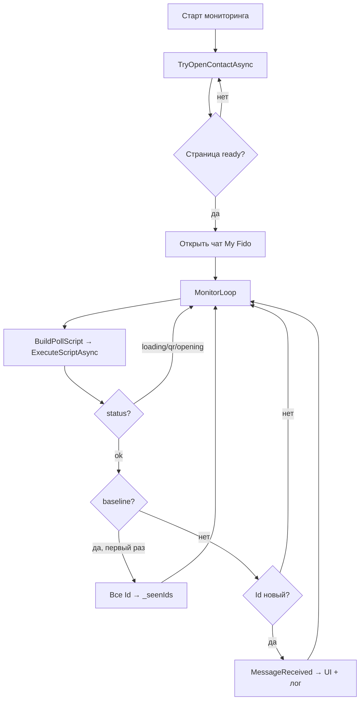

# Логика парсинга сообщений WhatsApp Web в WPF (локальная машина)

**Контакт:** My Fido (в WhatsApp Web — «My Fido (You)»)  
**Дата:** 2026-06-03  
**Код:** `src/WhatsAppToWpf/Services/WhatsAppWeb/`

---

## 1. Область отчёта

Документ описывает **только** то, как WPF-приложение на локальном компьютере получает текст сообщений из WhatsApp:

- браузер **WebView2** загружает `https://web.whatsapp.com`;
- C# периодически выполняет **JavaScript** в DOM страницы;
- найденные сообщения отображаются в главном окне и пишутся в локальный журнал.

Нет обращений к внешним серверам, облакам или API — весь цикл происходит на ПК пользователя.

---

## 2. Общая схема парсинга

```
web.whatsapp.com (DOM)
        │
        ▼  ExecuteScriptAsync (JS)
WhatsAppWebReader
        │
        ▼  JSON → WhatsAppWebPollResult
WhatsAppWebMonitorService
        │  baseline + dedup (_seenIds)
        ▼  WhatsAppMessage
MainWindow (ListView) + AppLogger (файл на диске)
```

**Участники:**

| Компонент | Функция в парсинге |
|-----------|-------------------|
| `WhatsAppWebScriptBuilder` | Генерирует JS: готовность, открытие чата, сбор сообщений |
| `WhatsAppWebReader` | Вызывает JS через WebView2, разбирает JSON |
| `WhatsAppWebMonitorService` | Таймер опроса, baseline, фильтрация новых |
| `WhatsAppMessage` | Модель для UI |

---

## 3. Предусловия парсинга

Перед сбором сообщений должны выполниться условия:

### 3.1. WebView2 инициализирован

- Профиль браузера: `%LocalAppData%\WhatsAppToWpf\WebViewProfile`
- Страница: `https://web.whatsapp.com`
- Пользователь авторизован (QR отсканирован один раз, сессия сохраняется локально)

### 3.2. Страница готова (`BuildIsReadyScript`)

| Проверка | Если не выполнено |
|----------|-------------------|
| QR не виден | Статус `qr` — парсинг невозможен |
| Есть `#pane-side` | Статус `loading` — ждём до 90 сек |
| В списке есть `span[title]` | Статус `loading` — чаты ещё не подгрузились |
| Список не пуст | Статус `ready` — можно открывать чат |

Ожидание: интервал **2 сек**, максимум **90 сек**.

### 3.3. Чат My Fido открыт (`BuildOpenChatScript`)

Парсер читает сообщения из `#main` только когда активен нужный чат.

**Сопоставление имени** (`matchesContact`, без учёта регистра):

- `My Fido` = `My Fido`
- `My Fido (You)` — совпадает, т.к. строка начинается с `My Fido`
- любая строка, **содержащая** `My Fido`

**Открытие чата — два способа:**

1. **Клик по списку** в `#pane-side`:
   - найти `span[title]` с подходящим именем;
   - подняться к `[data-testid="cell-frame-container"]` или `[role="listitem"]`;
   - `mousedown` + `click`.

2. **Fallback — строка поиска** (после 3 неудачных попыток):
   - фокус на `#side div[contenteditable="true"]`;
   - ввод «My Fido»;
   - пауза 1.8 сек;
   - повторный клик по результату.

До **12 попыток**, пауза **1.5 сек** между ними.

---

## 4. Цикл парсинга (MonitorLoop)

Запускается кнопкой **«Начать мониторинг»**.

```
каждые PollIntervalMs (по умолчанию 2000 мс):
  1. PollOnUiThreadAsync()  → JS на UI-потоке WebView2
  2. разбор WhatsAppWebPollResult
  3. baseline или выдача новых сообщений
```

Минимальный интервал: **500 мс** (из `settings.json`).

---

## 5. JavaScript-опрос DOM (`BuildPollScript`)

### 5.1. Шаги скрипта

1. **QR / загрузка** — если не готово, вернуть `qr` или `loading`.
2. **Проверка открытого чата** — заголовок `#main header` или `[data-testid="conversation-header"]` должен содержать имя контакта.
3. **Если чат не открыт** — вызов `findAndOpenChat()`, статус `opening`.
4. **Если чат открыт** — сбор контейнеров сообщений.

### 5.2. Селекторы сообщений

Контейнеры:

```text
#main [data-testid="msg-container"]
```

Текст внутри контейнера (по приоритету):

```text
[data-testid="msg-text"]
  → .copyable-text span
  → .selectable-text
  → innerText всего контейнера (fallback)
```

### 5.3. Фильтр по маркеру

Параметр `TextMarker` из настроек передаётся в JS.

- Пусто → все сообщения попадают в результат.
- Например `[Gemini]` → в массив попадают только строки, **содержащие** этот текст.

Фильтрация выполняется **в JavaScript до** возврата в C#.

### 5.4. Идентификатор сообщения

Для каждого контейнера:

1. `data-id` самого элемента;
2. `data-id` ближайшего родителя;
3. если атрибута нет — **SHA-256 от текста** (вычисляется в C# при маппинге).

Дубликаты с одним `Id` внутри одного опроса отбрасываются в JS (`Set`).

---

## 6. Обработка результата в C# (`WhatsAppWebMonitorService`)

### 6.1. Статусы опроса

| Статус | Парсинг сообщений |
|--------|-------------------|
| `ok` | Сообщения извлечены |
| `opening` | Чат открывается, сообщений пока нет |
| `chat_not_found` | Чат не найден |
| `loading` | DOM не готов |
| `qr` | Нужна авторизация |

### 6.2. Базовая линия (baseline)

**Первый** успешный опрос со статусом `ok` после старта мониторинга:

```
все messages[].id → _seenIds (HashSet)
в UI ничего не добавляется
лог: "Базовая линия: N сообщений"
```

Это отсекает уже существующую историю чата — в список попадают **только новые** сообщения после старта.

### 6.3. Последующие опросы

```
для каждого message:
  если message.Id уже в _seenIds → пропуск
  иначе → добавить в _seenIds
         → событие MessageReceived
         → строка в ListView (макс. 500 записей)
         → запись в локальный лог
```

### 6.4. Маппинг в модель

```csharp
WhatsAppMessage {
    FromName  = "My Fido",      // ContactDisplayName из настроек
    From      = "My Fido",
    Text      = текст из DOM,
    Id        = data-id или SHA-256,
    Timestamp = Unix UTC в момент опроса,
    DisplayTime = локальное время для колонки «Время»
}
```

> **Важно:** `Timestamp` — время **обнаружения** сообщения парсером, а не время отправки в WhatsApp.

---

## 7. Настройки, влияющие на парсинг

| Параметр | Файл | По умолчанию | Влияние |
|----------|------|--------------|---------|
| `ContactDisplayName` | `settings.json` | `My Fido` | Какой чат открывать и чьи сообщения собирать |
| `TextMarker` | `settings.json` | пусто | Фильтр текста в JS |
| `PollIntervalMs` | `settings.json` | `2000` | Частота опроса DOM |

Файл настроек лежит рядом с `WhatsAppToWpf.exe`.

---

## 8. Диаграмма цикла парсинга



---

## 9. Локальное журналирование

Файл: `Docs/Logs/WhatsAppToWpf_YYYY-MM-DD.log`

Пример успешного парсинга:

```text
[Info] WhatsApp Web готов, чатов в списке: 42
[Info] Открыт чат «My Fido»
[Info] Мониторинг WhatsApp Web запущен для «My Fido»
[Info] Базовая линия WhatsApp Web: 15 сообщений
[Info] Сообщение: My Fido — [Gemini] текст
[Info] Получено новых сообщений: 1
```

Окно **«Журнал»** в приложении показывает те же записи в реальном времени.

---

## 10. Ограничения парсинга (локально)

1. **Зависимость от DOM WhatsApp Web** — при обновлении сайта селекторы `data-testid` могут перестать работать.
2. **Задержка загрузки** — до появления списка чатов нужно 5–15 сек; без ожидания чат не откроется автоматически.
3. **Только сообщения в DOM** — WhatsApp Web не держит всю историю в DOM; сообщения вне видимой/подгруженной области могут не попасть в опрос.
4. **Время сообщения** — в UI показывается момент обнаружения, не оригинальный timestamp WhatsApp.
5. **Один контакт за сессию** — парсер настроен на один `ContactDisplayName`.
6. **WebView2 должен жить** — окно WhatsApp Web можно скрыть, но процесс WebView2 не должен быть завершён.

---

## 11. Минимальный сценарий проверки парсинга

1. Запустить `WhatsAppToWpf.exe`.
2. Дождаться загрузки WhatsApp Web и автоматического открытия чата My Fido.
3. Нажать **«Начать мониторинг»** — в логе: «Базовая линия: N сообщений».
4. Отправить новое сообщение в «My Fido (You)» (с телефона или из того же WhatsApp Web).
5. Через 2–4 сек в ListView и журнале появится строка с текстом сообщения.

---

*Отчёт описывает логику парсинга по коду `src/WhatsAppToWpf` на 2026-06-03. Только локальная машина, без внешних интеграций.*
